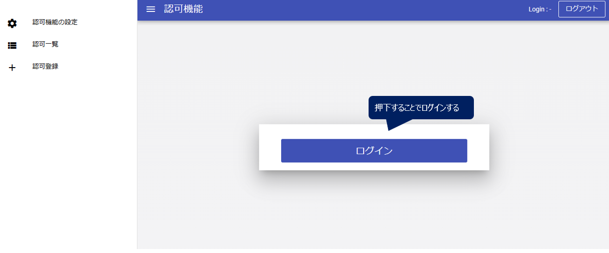
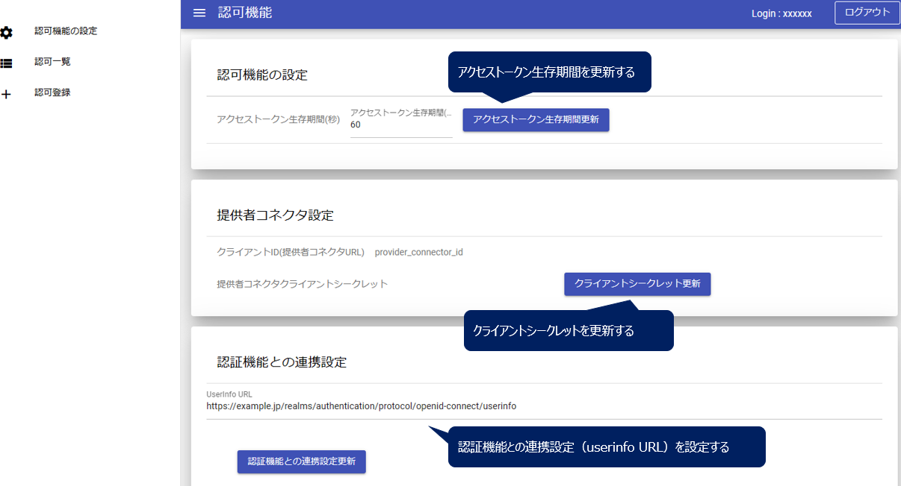

# 利用者
ここでは、利用者コネクタ、提供者コネクタを経由し、HTTPサーバからデータを取得する方法を説明する。

## 1. 利用者の認証
### 認証サーバへのアクセス情報を加える
ここで接続するCADDE認証サーバ`authn.ut-cadde.jp`は独自に定義したドメインであるため、`/etc/hosts`ファイルでIPアドレス（`172.26.16.20`）との対応を書き換えておく必要がある。
```bash
sudo vi /etc/hosts
```
```
...
127.0.0.1	localhost
255.255.255.255	broadcasthost
::1             localhost

# ↓この行を追加する
172.26.16.20 authn.ut-cadde.jp
```

### トークン取得APIの実行
認証サーバの利用者トークン取得エンドポイントに対し、利用者IDやパスワードを指定して認証を行い、CADDE利用者トークンを取得する。CADDE利用者トークンはレスポンスの`access_token`というkeyで返される。利用者トークンの有効期間は5分間に設定しているため注意が必要。

APIの実行例は以下の通り。利用者ID・パスワードとWebAppクライアントID・シークレットをJSON形式で送信する。なお、ここでは認証サーバとHTTPS通信を行うために、認証サーバ証明書のルート証明書である、研究室内プライベート認証局の証明書パスを`curl`コマンドで指定する必要がある。

```bash
curl -v -X POST "https://authn.ut-cadde.jp:18443/cadde/api/v4/token" -sS \
-H "Content-Type: application/json" \
-d '{"user_id": "{利用者ID}", "password": "{利用者パスワード}", "client_id": "consumer1_webapp", "client_secret": "X0IwpZHnuFI8uduRkM5RV5A8F1XJwF3T"}' \
--cacert {プライベートCA証明書のパス}
```
```bash
...
{"access_token":"eyJhb...","refresh_token":"eyJhb..."}
```

## 2. 横断検索
利用者コネクタのカタログ検索エンドポイントに対し、接続する利用者コネクタと探したいリソースの検索キーを指定し、カタログ横断検索を行う。検索キーである文字列を指定すると、データセットのタイトルやその文字列をタイトルに含むリソースが含まれるデータセットの情報が返される。

APIの実行例は以下の通り。ここでは横断検索であることをコネクタに伝えるために`x-cadde-search`ヘッダに`meta`という値をセットしている。なお、ここでは利用者コネクタとHTTPS通信を行うために、研究室内プライベート認証局の証明書パスを`curl`コマンドで指定する必要がある。
```bash
curl -v -X GET "https://{利用者コネクタのFQDN}:{ポート番号}/cadde/api/v4/catalog?q={検索キー}" -sS \
-H "Cache-Control: no-cache" \
-H "x-cadde-search: meta" \
--cacert {プライベートCA証明書のパス}
```

## 3. 詳細検索
利用者コネクタのカタログ検索エンドポイントに対し、接続する利用者コネクタと検索したいデータセットのIDをURL内に指定し、さらに提供者IDとCADDE利用者トークンをHTTPヘッダに付与して、提供者が管理する詳細検索用カタログサイトで詳細検索を行う。詳細検索の結果、IDが一致するデータセットの情報が返される。

APIの実行例は以下の通り。ここでは横断検索であることをコネクタに伝えるために`x-cadde-search`ヘッダに`detail`という値を指定し、また`x-cadde-provider`ヘッダに提供者IDを指定する。`Authorization`ヘッダには利用者認証で取得した利用者トークンをセットする。なお、ここでは利用者コネクタとHTTPS通信を行うために、研究室内プライベート認証局の証明書パスを`curl`コマンドで指定する必要がある。
```bash
curl -v -X GET 'https://{利用者コネクタのFQDN}:{ポート番号}/cadde/api/v4/catalog?fq=caddec_dataset_id_for_detail:{詳細検索用データセットID}' -sS \
-H "Cache-Control: no-cache" \
-H "x-cadde-search: detail" \
-H "x-cadde-provider: {提供者ID}" \
-H "Authorization:Bearer {利用者トークン}" \
--cacert {プライベートCA証明書のパス}
```

## 4. データ取得
詳細検索で得たカタログ情報を元に、利用者コネクタのデータ取得APIに対し、データURLや提供者ID、利用者トークンをHTTPヘッダに付与して、提供者が管理するHTTPサーバからデータファイルを取得する。

APIの実行例は以下の通り。ここではHTTPサーバからのデータ取得であることを示すため`x-cadde-resource-api-type`ヘッダに`file/http`という値を指定する。`x-cadde-resource-url`にはデータURL、`x-cadde-provider`ヘッダに提供者ID、`Authorization`ヘッダには利用者認証で取得した利用者トークンをセットする。また、`curl`コマンドの`-o`オプションで取得したデータをファイルに出力できる。なお、ここでは利用者コネクタとHTTPS通信を行うために、研究室内プライベート認証局の証明書パスを指定する必要がある。
```bash
curl -v -X GET "https://{利用者コネクタのFQDN}:{ポート番号}/cadde/api/v4/file" -sS \
-H "Cache-Control: no-cache" \
-H "x-cadde-resource-url: {データURL}" \
-H "x-cadde-resource-api-type: file/http" \
-H "x-cadde-provider: {提供者ID}" \
-H "Authorization:Bearer {利用者トークン}" \
-o {出力ファイル名} \
--cacert {プライベートCA証明書のパス}
```


# 提供者
ここでは、コネクタを経由してデータを提供するために、提供者が事前に準備する必要のある項目について説明する。
## 1. CKANでのデータカタログ登録
詳細検索用カタログサイト、横断検索カタログサイトそれぞれにカタログ情報を登録する。

研究室内UT-CADDEでは2023年8月21日現在、実装の都合上、詳細検索・横断検索で同一のカタログサイト（[172.26.16.16:5000](172.26.16.16:5000)）を用いているため、当該サイトで一括してカタログ情報を登録する。


## 2. 提供者コネクタのデータ管理コンフィグ設定
提供者コネクタからアクセス可能なHTTPサーバのURLをコンフィグファイル`connector-main/swagger_server/configs/http.json`で設定する。
```json
"authorization": [
    {
        "url": "{リソースURL}",
        "enable": true
    }
],
"contract_management_service": [
    {
        "url": "{リソースURL}",
        "enable": false
    }
],
"register_provenance": [
    {
        "url": "{リソースURL}",
        "enable": false
    }
]
```
## 3. 認可登録
データに対する認可登録をGUIで行う方法を説明する。

まず、ブラウザのアドレスバーに構築した認可機能のURLを入力してアクセスする。

### ログイン
認可機能にアクセスするとトップ画面に表示される「ログイン」ボタンを押下すると、認証機能（Keycloakサーバ）のログイン画面に遷移する。そこで、CADDE提供者IDとパスワードを入力し、ログインに成功すると、ログイン状態となり認可機能の画面に戻る。




ログイン状態では、画面左に表示されている認可機能の各メニューを利用することができるようになる。

### 「認可登録」メニュー
画面左の「認可登録」メニューからリソースに対する認可の登録ができる。認可登録にあたっては、リソースのURLといくつかの認可の条件を入力する必要がある。

リソースURLは必須項目である。また、認可の条件は、「ユーザに対する認可」、「組織に対する認可」、「当人認証に対する認可」の3つがあるが、少なくともひとつに関して入力する必要がある。
- ユーザに対する認可
  - ユーザ単位での認可
  - 認証機能で登録されたCADDE利用者IDを指定する
- 組織に対する認可
  - 組織単位での認可
  - 認証機能で登録されたCADDEを利用する組織IDを指定する
    - これはCADDE利用者の`org`属性に登録される
- 当人認証レベルに対する認可
  - 利用者の認証レベル（AAL）に対する認可
  - AALは、ユーザ認証時の認証の要素数などによって異なる
  - CADDEデフォルトのAALは2
    - これはパスワード認証に加えて、ワンタイムパスワード（OTP）やクライアント証明書など所有による認証も行う場合のレベル

リソースURLと認可の条件を記入したのち、「認可設定」ボタンを押下すると認可を登録することができる。
正常に登録された認可は「認可一覧」画面にて確認することができる。


### 「認可一覧」画面
画面左の「認可一覧」メニューから登録された認可の一覧を確認できる。
認可はリソースURLごとに表示されており、各URL部分を押下することで、選択したリソースの認可の詳細を確認できる。


各リソースの認可詳細画面では、認可の確認・削除ができる。
認可の表のユーザ、組織、AALの列は、それぞれ、「ユーザに対する認可」、「組織に対する認可」、「当人認証に対する認可」の条件に対応する。取引IDの列は、契約有りの認可設定の際に付番された取引IDを示している。つまり、取引IDのある認可は契約管理によって登録された認可である。

認可を削除したい場合、削除対象の認可の行を押下することで選択状態になるため、その状態で「認可削除」ボタンを押下することで、認可を削除することができる。
リソースURLに付与されている全ての認可を削除した場合、「認可一覧」画面から当該URLは削除される。


### 「認可機能の設定」画面
「認可機能の設定」画面では、認可機能自体の設定を変更することができる。ここでは以下の項目を確認・変更することができるが、通常の利用では操作することはない。
- アクセストークン生存期間: 認可機能が発行するアクセストークンの生存期間を確認・変更する
- クライアントID: 提供者コネクタのクライアントIDを確認する
- 提供者クライアントシークレット： 認可機能が発行する提供者コネクタのクライアントシークレットを確認・変更する
- UserInfo URL： 認証機能と連携する際に使用するUserInfo URLを確認・変更する



