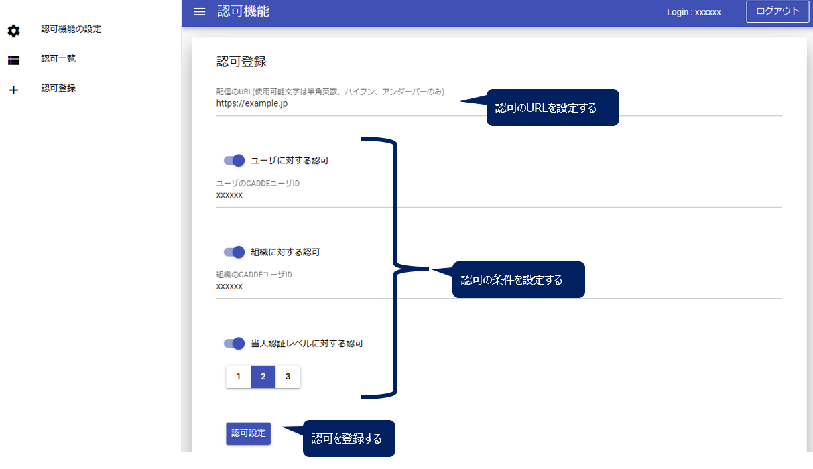

# 利用者
ここでは、利用者コネクタ、提供者コネクタを経由し、HTTPサーバからデータを取得する方法を説明する。

## 1. 利用者の認証
### 事前準備: 認証サーバへのアクセス情報を加える
利用者コネクタの利用時にはCADDEユーザとして認証される必要がある。

このときCADDE全体の認証サーバにアクセスするが、CADDE構築デモで利用する認証サーバ`authn.ut-cadde.jp`のドメインは独自に定義したものである。そこで、`/etc/hosts`ファイルでCADDE構築デモ用認証サーバのドメイン名とIPアドレス（`172.26.16.20`）との対応を書き加えておく。
```
...
127.0.0.1	localhost
255.255.255.255	broadcasthost
::1             localhost

# ↓この行を追加する
172.26.16.20 authn.ut-cadde.jp
```

### トークン取得APIの実行
認証サーバの利用者トークン取得エンドポイントに対し、利用者IDやパスワードを指定して認証を行い、CADDE利用者トークンを取得する。

CADDE利用者トークンはJSON形式のレスポンス内で`access_token`というkeyに対応している。


APIの実行例は以下の通り。利用者ID・パスワードと利用者WebAppのクライアントID・シークレットをJSON形式で送信する。

CADDE構築デモでは利用者WebAppクライアントは固定のものを用いるため、利用者ID・パスワードの箇所のみを入力すればよい。また、ローカルマシンと認証サーバのHTTPS通信を行うために、認証サーバのCA証明書、すなわち研究室内プライベート認証局の証明書ファイル`cacert.pem`のパスを`--cacert`オプションで指定する。

※ 研究室内プライベート認証局の証明書 `cacert.pem`はプライベート認証局の担当者から事前に受け取っておく。

```bash
curl -v -X POST "https://authn.ut-cadde.jp:18443/cadde/api/v4/token" -sS \
-H "Content-Type: application/json" \
-d '{"user_id": "<利用者ID>", "password": "<利用者パスワード>", "client_id": "consumer1_webapp", "client_secret": "X0IwpZHnuFI8uduRkM5RV5A8F1XJwF3T"}' \
--cacert <cacert.pemのパス>
```
```bash
# output
...
{"access_token":"eyJhb...","refresh_token":"eyJhb..."}
```

ここで取得したCADDE利用者トークンは以降の[詳細検索](#3-詳細検索)や[データ取得](#4-データ取得)の際に用いる。トークンの有効期間は1時間に設定しているため、有効期間が過ぎれば再度APIを実行してCADDE利用者トークンを取得し直す。

## 2. 横断検索
利用者コネクタのカタログ検索エンドポイントに対し、接続する利用者コネクタURLと探したいリソースの検索キーを指定し、カタログ横断検索を行う。検索キーの文字列を指定すると、データセットのタイトルやその文字列をタイトルに含むリソースが含まれるデータセットの情報が返される。

APIの実行例は以下の通り。横断検索APIのリクエストでは`x-cadde-search`ヘッダに`meta`という値をセットする。利用者コネクタのFQDNとしては、[利用者コネクタ構築時](./install.md#113-コンフィグファイルの設定)に適当に設定したドメインを指定すればよい。また、CADDE構築デモでの利用者コネクタのポート番号はデフォルトで`10443`である。
なお、ここではローカルマシンと利用者コネクタの間でHTTPS通信を行うために、研究室内プライベート認証局の証明書`cacert.pem`のパスを`--cacert`オプションで指定する。

また、現在利用できるデータカタログは研究室内の横断検索用カタログサイト[172.26.16.16:5000](http://172.26.16.16.5000)でも確認できる。
```bash
curl -v -X GET "https://<利用者コネクタのFQDN>:<ポート番号>/cadde/api/v4/catalog?q=<検索キー>" -sS \
-H "Cache-Control: no-cache" \
-H "x-cadde-search: meta" \
--cacert <cacert.pemのパス>
```

## 3. 詳細検索
利用者コネクタのカタログ検索エンドポイントに対し、接続する利用者コネクタと検索したいデータセットのIDをURL内に指定し、さらに提供者IDとCADDE利用者トークンをHTTPヘッダに付与して、提供者が管理する詳細検索用カタログサイトで詳細検索を行う。詳細検索の結果、データセットIDが一致したデータセットの情報が返される。

詳細検索用のデータセットIDは、[横断検索](#2-横断検索)の結果に含まれる`caddec_dataset_id_for_detail`というkeyに対応するvalueである。

APIの実行例は以下の通り。詳細検索APIのリクエストでは`x-cadde-search`ヘッダに`detail`という値を指定し、また`x-cadde-provider`ヘッダに詳細検索カタログを保有する提供者IDを指定する。`Authorization`ヘッダには[利用者認証](#1-利用者の認証)で取得した利用者トークンをセットする。

なお、ここでもローカルマシンと利用者コネクタの間でHTTPS通信を行うために、研究室内プライベート認証局の証明書`cacert.pem`のパスを`--cacert`オプションで指定する。
```bash
curl -v -X GET 'https://<利用者コネクタのFQDN>:<ポート番号>/cadde/api/v4/catalog?fq=caddec_dataset_id_for_detail:<詳細検索用データセットID>' -sS \
-H "Cache-Control: no-cache" \
-H "x-cadde-search: detail" \
-H "x-cadde-provider: <提供者ID>" \
-H "Authorization:Bearer <CADDE利用者トークン>" \
--cacert <cacert.pemのパス>
```

## 4. データ取得
詳細検索で得たカタログ情報を元に、利用者コネクタのデータ取得APIに対し、データURLや提供者ID、利用者トークンをHTTPヘッダに付与して、提供者が管理するHTTPサーバからデータファイルを取得する。

APIの実行例は以下の通り。CADDE構築デモではHTTPサーバからのデータ取得を行うため`x-cadde-resource-api-type`ヘッダに`file/http`という値を指定する。`x-cadde-resource-url`にはデータURL、`x-cadde-provider`ヘッダに提供者ID、`Authorization`ヘッダには利用者認証で取得したCADDE利用者トークンをセットする。また、`curl`コマンドの`-o`オプションで取得したデータをファイルに出力できる。ここでもローカルマシンと利用者コネクタの間でHTTPS通信を行うために、研究室内プライベート認証局の証明書`cacert.pem`のパスを`--cacert`オプションで指定する。
```bash
curl -v -X GET "https://<利用者コネクタのFQDN>:<ポート番号>/cadde/api/v4/file" -sS \
-H "Cache-Control: no-cache" \
-H "x-cadde-resource-url: <データURL>" \
-H "x-cadde-resource-api-type: file/http" \
-H "x-cadde-provider: <提供者ID>" \
-H "Authorization:Bearer <CADDE利用者トークン>" \
-o <出力ファイル名> \
--cacert <cacert.pemのパス>
```


# 提供者
ここでは、コネクタを経由してデータを提供するために、提供者が事前に準備する必要のある項目について説明する。
## 1. CKANでのデータカタログ登録
詳細検索用カタログサイト、横断検索カタログサイトそれぞれにカタログ情報を登録する。

研究室内UT-CADDEでは2023年9月7日現在、実装の都合上、詳細検索・横断検索で同一のカタログサイト（[172.26.16.16:5000](http://172.26.16.16:5000)）を用いているため、同サイトで一括してカタログ情報を登録する。

### ユーザ登録
まず、[カタログサイト](http://172.26.16.16:5000)トップページで、右上に表示されている`Register`からユーザ登録を行う。
ここでのユーザはCADDE認証機能に登録されているものとは関係がないため、自分が分かるように設定するだけでよい。


### データセット登録
ユーザ登録完了後、提供者コネクタを用いて提供したいデータセットを登録する。
CKANではデータセットをOrganization単位でまとめることができるため、デモにあたっては`klab`というOrganizationの下にデータセットを追加していくと分かりやすいように思われる。Organizationの一覧は画面上部メニューの`Organizations`から確認できる。


`klab`の下にデータセットを登録していく。データセットの追加は`Add Dataset`ボタンから行える。


`Add Dataset`ボタンを押下すると、まずデータセットのメタデータを登録する。登録が必須である項目は以下の通り。`caddec_dataset_id_for_detail`と`caddec_provider_id`はCADDE独自の拡張項目であるため、`Custom Field`の箇所で設定する。
- `Title`: データセットのタイトル
- `caddec_dataset_id_for_detail`: CADDEにおけるデータセットの識別子
- `caddec_provider_id`: CADDEにおけるデータセットの提供者ユーザID


メタデータの登録が完了すれば、`Next: Add Data`ボタンから実際に提供するデータファイルを登録していく。

ここではカタログサイトとは別サーバに保存してあるデータファイルにアクセスするためのリンクをそれぞれ登録するため、`Upload`と`Link`という2つの選択肢のうち、`Link`を選択する。
その後、データファイルのURLやファイルを識別するための`Name`を入力する。

ファイルのリンクを登録できれば、`Finish`ボタンを押してデータセットの追加が完了となる。
なお、複数ファイルを追加する場合は`Save & add another`ボタンから行う。


## 2. 提供者コネクタのデータ管理コンフィグ設定
提供者コネクタからアクセスして提供するデータファイルのURLをコンフィグファイル`klab-connector-v4/src/provider/connector-main/swagger_server/configs/http.json`で設定する。

データファイルの追加の際は、`http.json`内の`authorization`, `contract_management_service`

CADDE構築デモにあたっては、`authorization`（認可設定）, `contract_management_service`（取引市場設定）, `register_provenance`（来歴管理設定）の3項目にリソースURLを追加する。このとき、`enable`という項目で、それぞれ対応するサービスを利用するかどうかを制御できる。

CADDE構築デモでは取引市場の利用や来歴登録は対象外であるため、`authorization.enable`のみ`true`で設定しておき、`contract_management_service.enable`や`register_provenance.enable`は`false`としておく。

```json
"authorization": [
    {
        "url": "<リソースURL>",
        "enable": true
    }
],
"contract_management_service": [
    {
        "url": "<リソースURL>",
        "enable": false
    }
],
"register_provenance": [
    {
        "url": "<リソースURL>",
        "enable": false
    }
]
```
## 3. 認可登録
データに対する認可登録をGUIで行う方法を説明する。

まず、ブラウザのアドレスバーにローカルマシン上で構築した認可機能のURLを入力してアクセスする。CADDE構築デモにおける認可機能のポート番号はデフォルトで`5080`であるため、[localhost:5080](http://localhost:5080)や[127.0.0.1:5080](http://127.0.0.1:5080)からアクセスできるはずである。

### ログイン
認可機能にアクセスするとトップ画面に表示される「ログイン」ボタンを押下すると、認証機能（Keycloakサーバ）のログイン画面に遷移する。そこで、CADDE提供者IDとパスワードを入力し、ログインに成功すると、ログイン状態となり認可機能の画面に戻る。


ログイン状態では、画面左に表示されている認可機能の各メニューを利用することができるようになる。

### 「認可登録」メニュー
画面左の「認可登録」メニューからリソースに対する認可の登録ができる。認可登録にあたっては、リソースのURLといくつかの認可の条件を入力する必要がある。

リソースURLは必須項目である。また、認可の条件は、「ユーザに対する認可」「組織に対する認可」「当人認証レベルに対する認可」の3つがあるが、このうち少なくとも一つに関して入力する必要がある。

- ユーザに対する認可
  - ユーザ単位での認可
  - 認証機能で登録されたCADDE利用者IDを指定する
- 組織に対する認可
  - 組織単位での認可
  - 認証機能で登録されたCADDEを利用する組織IDを指定する
    - これはCADDE利用者の`org`属性に登録される
- 当人認証レベルに対する認可
  - 利用者の認証レベル（AAL）に対する認可
  - AALは、ユーザ認証時の認証の要素数などによって異なる
  - CADDEデフォルトのAALは2
    - これはパスワード認証に加えて、ワンタイムパスワード（OTP）やクライアント証明書など所有による認証も行う場合のレベル

リソースURLと認可の条件を記入したのち、「認可設定」ボタンを押下すると認可を登録することができる。
正常に登録された認可は「認可一覧」画面にて確認することができる。



### 「認可一覧」画面
画面左の「認可一覧」メニューから登録された認可の一覧を確認できる。
認可はリソースURLごとに表示されており、各URL部分を押下することで、選択したリソースの認可の詳細を確認できる。


各リソースの認可詳細画面では、認可の確認・削除ができる。
認可の表のユーザ、組織、AALの列は、それぞれ、「ユーザに対する認可」「組織に対する認可」「当人認証レベルに対する認可」の条件に対応する。取引IDの列は、契約有りの認可設定の際に付番された取引IDを示している。つまり、取引IDのある認可は契約管理によって登録された認可である。

認可を削除したい場合、削除対象の認可の行を押下することで選択状態になるため、その状態で「認可削除」ボタンを押下することで、認可を削除することができる。
リソースURLに付与されている全ての認可を削除した場合、「認可一覧」画面から当該URLは削除される。


### 「認可機能の設定」画面
「認可機能の設定」画面では、認可機能自体の設定や提供者コネクタの設定、認証機能との連携設定を変更することができる。
- 認可機能の設定
    - アクセストークン生存期間: 認可機能が発行するアクセストークンの生存期間を確認・変更する
- 提供者コネクタ設定
    - クライアントID: 提供者コネクタのクライアントIDを確認する
    - 提供者コネクタクライアントシークレット： 認可機能が発行する提供者コネクタのクライアントシークレットを確認・変更する
- 認証機能との連携設定
    - UserInfo URL： 認証機能と連携する際に使用するUserInfo URLを確認・変更する


なお、[install.md](./install.md#213-コンフィグファイルの設定)で述べたように、提供者コネクタを適切に動作させるためには提供者コネクタの設定ファイル`klab-connector-v4/src/provider/connector_main/swagger_server/configs/connector.json`内で認可機能が発行した提供者コネクタのクライアントシークレットを記入する必要があった。

そこで、本画面で提供者コネクタクライアントシークレットとして表示されている文字列をコピーし、提供者コネクタ内`connector.json`に記入し直す必要がある。

この設定は一度完了していれば、提供者コネクタや認可機能の再起動時に改めて設定し直す必要はない。
