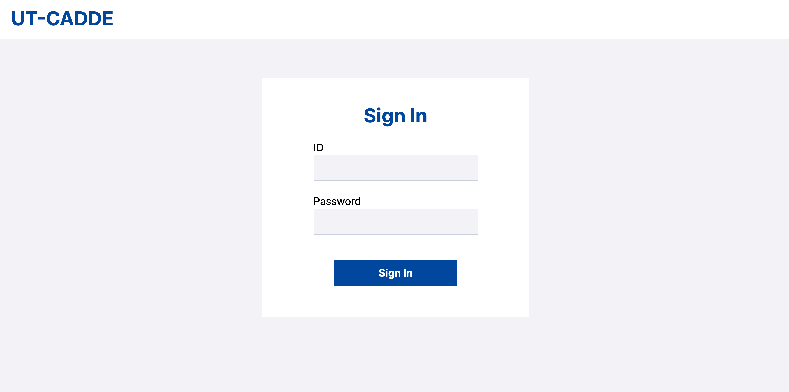

# データ利用者環境の構築

# 前提

## CADDEテストベッド参加のための事前準備

CADDEテストベッドの利用開始にあたって、テストベッド参加者は[CADDEテストベッド参加のための事前準備](./README.md#caddeテストベッド参加のための事前準備)を行う必要がある。

以降のデータ提供者環境の構築にあたっては、以下の作業が完了していることを前提とする。
- [CADDEテストベッド利用情報の取得](./README.md#caddeテストベッド利用情報の取得)
- [CADDEテストベッド参加者環境のドメイン登録](./README.md#caddeテストベッド参加者環境のドメイン登録)
- [CADDEテストベッド用TLS証明書の取得](./README.md#caddeテストベッド用tls証明書の取得)

## 実行環境
<!-- TODO: 詳細に記述する -->
データ利用者環境を構築するマシンは以下の条件を満たすことを前提とする。
- OS：Linux
- CPU：2コア
- メモリ：4GB
- ディスク：20GB

また、以下のコマンドおよびソフトウェアが利用可能であることを前提とする。
- curl
- jq
- git
- docker
- openssl


# 1. インストール

データ利用者環境では、以下2つのアプリケーションを構築する。
- 利用者コネクタ
- 利用者WebApp

はじめに、これ以降の作業を行うディレクトリを作成し、以降のコマンドでは環境変数${WORKDIR}で参照することとする。
```bash
$ mkdir ~/cadde_testbed
$ cd ~/cadde_testbed
$ export WORKDIR=$PWD
```

## 1.1. 利用者コネクタ環境準備

### 1.1.1. 利用者コネクタ取得
GitHubからCADDEコネクタリポジトリをクローンする。

```bash
$ cd ${WORKDIR}
$ git clone https://github.com/Koshizuka-lab/klab-connector-v4.git
$ cd klab-connector-v4
$ git switch testbed
```

ブランチが`testbed`であることを確認する。
```bash
$ git branch
  main
* testbed
```

`klab-connector-v4/src/consumer`に利用者コネクタ用ソースコードが配置してある。


### 1.1.2. 共通ファイルの展開
`setup.sh`を実行する。
```bash
$ cd ${WORKDIR}/klab-connector-v4/src/consumer
$ sh setup.sh
```

### 1.1.3. リバースプロキシの設定
利用者コネクタに対する通信はHTTPSによる接続が推奨される。
そこで、リバースプロキシ上でTLSサーバ証明書の設定を行う。

#### 秘密鍵・サーバ証明書の準備
[certificate.md](certificate.md)に従い、CADDEテストベッド参加サイト用の秘密鍵とワイルドカード証明書のペアを作成する。

秘密鍵とワイルドカード証明書の作成後、それらを配置するためのディレクトリを作成する。
このディレクトリはリバースプロキシ用Dockerコンテナにマウントされる。

```bash
$ mkdir ${WORKDIR}/klab-connector-v4/src/consumer/nginx/volumes/ssl
```

上で作成したディレクトリに秘密鍵とワイルドカード証明書のファイルをそれぞれ`server.key`、`server.crt`というファイル名で配置する
（ただし、これらのファイル名はNginxの設定ファイルを編集することで変更可能）。

ディレクトリが以下の状態になれば完了である。
```bash
$ ls ${WORKDIR}/klab-connector-v4/src/consumer/nginx/volumes/ssl
server.crt  server.key
```

### 1.1.4. フォワードプロキシの設定
CADDEはデータ共有の信頼性を高めるため、利用者コネクタ - 提供者コネクタ間の相互TLS通信をサポートしている。
ここでは、提供者コネクタに提示するクライアント証明書、および提供者コネクタに対するインタフェースとなるフォワードプロキシの準備を行う。

#### 秘密鍵・クライアント証明書の準備
[certificate.md](certificate.md)に従い、CADDEテストベッド参加サイト用の秘密鍵とワイルドカード証明書のペアを作成する。
ここでは準備作業を簡単にするため、リバースプロキシと同じ秘密鍵・ワイルドカード証明書を用いることとする。

秘密鍵とワイルドカード証明書の作成後、それらを配置するためのディレクトリを作成する。
このディレクトリはフォワードプロキシ用Dockerコンテナにマウントされる。
```bash
$ mkdir ${WORKDIR}/klab-connector-v4/src/consumer/squid/volumes/ssl
```

上で作成したディレクトリに秘密鍵とワイルドカード証明書のファイルをそれぞれ`client.key`、`client.crt`というファイル名で配置する
（ただし、これらのファイル名はSquidの設定ファイルを編集することで変更可能）。

なお、秘密鍵・ワイルドカード証明書はいずれもフォワードプロキシ用コンテナ内部にマウントされるため、コンテナ内のユーザから読み取りできるようにファイルのアクセス権限を変更しておく。
```bash
$ chmod +r ${WORKDIR}/klab-connector-v4/src/consumer/squid/volumes/ssl/client.key
$ chmod +r ${WORKDIR}/klab-connector-v4/src/consumer/squid/volumes/ssl/client.crt
```

ディレクトリが以下の状態になれば完了である。
```bash
$ ls -l ${WORKDIR}/klab-connector-v4/src/consumer/squid/volumes/ssl
total 20
-rw-r--r-- 1 ubuntu ubuntu 6200 Aug  7 02:56 client.crt
-rw-r--r-- 1 ubuntu ubuntu 3272 Aug  7 02:56 client.key
```

#### SSL Bump用自己署名SSL証明書を作成
フォワードプロキシは利用者コネクタ - 提供者コネクタ間のTLSセッションを中継する機能を持つ。
これをSSL Bumpという。

CADDEの実装では、利用者コネクタが提供者コネクタにアクセスするたび、SSL Bumpを利用することでフォワードプロキシがクライアント証明書を提示するようにする。

このとき、利用者コネクタ本体は一時的にフォワードプロキシとの間にTLSセッションを張るため、フォワードプロキシにTLS証明書を配置する必要がある。
そこで、フォワードプロキシに自己署名TLS証明書を配置し、プロキシがその証明書を基に動的にサーバ証明書を生成し、利用者コネクタ本体に提示するようにしている。

以上の動作を実現するため、以下のコマンドでフォワードプロキシ上にSSL Bump用自己署名TLS証明書を`squidCA.pem`という名前で作成する。
```bash
$ cd ${WORKDIR}/klab-connector-v4/src/consumer/squid/volumes/ssl
$ openssl req -new -newkey rsa:4096 -days 365 -nodes -x509 -keyout squidCA.pem -out squidCA.pem -subj "/C="
```

さらに、フォワードプロキシ用自己署名証明書についても、コンテナ内のユーザから読み取りできるようにファイルのアクセス権限を変更しておく。
```bash
$ chmod +r ${WORKDIR}/klab-connector-v4/src/consumer/squid/volumes/ssl/squidCA.pem
```

ディレクトリが以下の状態になれば完了である。
```bash
$ ls -l ${WORKDIR}/klab-connector-v4/src/consumer/squid/volumes/ssl
total 20
-rw-r--r-- 1 ubuntu ubuntu 6200 Aug  7 02:56 client.crt
-rw-r--r-- 1 ubuntu ubuntu 3272 Aug  7 02:56 client.key
-rw-r--r-- 1 ubuntu ubuntu 5021 Aug  7 03:01 squidCA.pem
```
<!-- TODO: 引数でdnを入力する -->
<!-- なお、証明書の作成過程でサーバの識別情報が聞かれるが、Common Name以外の項目はスキップまたは適当な文字列で設定すればよい。
Common Nameは適当な文字列でよい。 -->

<!-- #### 外部ポートへのTLS通信を許可する -->
<!-- ```
acl SSL_ports port 1-65535
``` -->


#### フォワードプロキシの初期セットアップ
利用者コネクタ全体を起動する前に、フォワードプロキシ用コンテナを一度起動させ、SSL Bumpの初期設定を行う。

まず、以下のコマンドを実行してフォワードプロキシを起動する。
```bash
$ cd ${WORKDIR}/klab-connector-v4/src/consumer/squid
$ docker compose -f docker-compose_initial.yml up -d --build
```

以下のコマンドでフォワードプロキシが起動しているか確認する。
```bash
$ docker compose -f docker-compose_initial.yml ps
```

次に、以下のコマンドを実行してSSL Bumpで用いられるデータベースを初期化する。
```bash
$ docker exec -it forward-proxy /usr/lib/squid/security_file_certgen -c -s /var/lib/squid/ssl_db -M 20MB
Initialization SSL db...
Done
```

そして、フォワードプロキシ用コンテナ内部のディレクトリをホストにコピーする。
プロキシコンテナ内の`var/lib/squid/ssl_db`ディレクトリをホスト上の`src/consumer/squid/volumes`以下にコピーする。
```bash
$ docker cp forward-proxy:/var/lib/squid/ssl_db ./volumes/
```

以上でフォワードプロキシの初期設定は完了であるため、コンテナを終了させる。
```bash
$ docker compose -f docker-compose_initial.yml down
```


### 1.1.5. データカタログの接続設定
横断検索カタログから取得したいデータを検索するため、横断検索機能APIのURLを以下のファイルに設定する。
- `klab-connector-v4/src/consumer/catalog-search/swagger_server/configs/public_ckan.json`

設定すべきパラメータは以下の通り。

| 設定パラメータ | 概要 |
| :---------- | :---- |
| public_ckan_url | 横断検索機能APIのURL |

以下に設定例を示す。
```json
{
    "public_ckan_url": "http://cadde-federated-catalog.koshizukalab.dataspace.internal:25000/api/package_search"
}
```

### 1.1.6. 認証機能の接続設定
認証機能との接続には、認証機能によって割り当てられた利用者コネクタの情報が必要である。
この情報を以下のファイルに設定する。
- `klab-connector-v4/src/consumer/connector-main/swagger_server/configs/connector.json`

設定すべきパラメータは以下の通り。

| 設定パラメータ | 概要 |
| :--------- | :------- |
| consumer_connector_id | 認証機能発行の利用者コネクタのクライアントID |
| consumer_connector_secret | 認証機能発行の利用者コネクタのクライアントシークレット |
| location_service_url | ロケーションサービスのアクセスURL | -->
| trace_log_enable | コネクタの詳細ログ出力有無（出力無の設定でも基本的な動作ログは出力される） |

ただし、`location_service_url`については、CADDEテストベッドはロケーションサービスを含まないため、何も入力しないようにする。

以下に設定例を示す。
```json
{
    "consumer_connector_id" : "consumer-test2",
    "consumer_connector_secret" : "XXX",
    "location_service_url" : "",
    "trace_log_enable" : true 
}
```


### 1.1.7. 提供者コネクタの接続設定
データ提供者のCADDEユーザIDと提供者コネクタのロケーションを紐づける設定を以下のファイルで行う。
- `klab-connector-v4/src/consumer/connector-main/swagger_server/configs/location.json`

なお、ロケーションサービスを利用することで自動的に提供者コネクタのロケーションを解決することも可能であるが、CADDEテストベッドはロケーションサービスを含まないため、手動で提供者コネクタのロケーションを追記していく。

設定すべきパラメータは以下の通り。

| 設定パラメータ | 概要 |
| :--------- | :------- |
| connector_location | 提供者IDとコネクタURLのマッピング |
| connector_location.<提供者ID> | CADDEユーザID(提供者) を記載する |
| connector_location.<提供者ID>.provider_connector_url | 提供者コネクタのアクセスURL |

以下に設定例を示す。
```json
{
    "connector_location": {
        "test1": {
            "provider_connector_url": "https://cadde-provider-test1.koshizukalab.dataspace.internal:1443"
        },
        ...
    }
}
```


### 1.1.8. 来歴管理の接続設定
来歴管理機能を利用する場合、来歴管理サーバURLを以下のファイルに設定する。
- `klab-connector-v4/src/consumer/provenance-management/swagger_server/configs/provenance.json`

設定すべきパラメータは以下の通り。

| 設定パラメータ                     | 概要                                  |
| :------------------------------ | :----------------------------------- |
| provenance_management_api_url | 来歴管理機能APIのベースURL |

以下に設定例を示す。
```json
{
    "provenance_management_api_url": "http://cadde-provenance-management.koshizukalab.dataspace.internal:3000/v2"
}
```


### 1.1.9. その他カスタマイズ可能な項目

#### 利用者コネクタのポート番号
`docker-compose.yml`を編集することで、利用者コネクタを起動する際のポート番号を変更することができる。

以下の例では利用者コネクタをホストマシンの80, 443番で立ち上げ、コンテナの80, 443番ポートにそれぞれフォワーディングしている。
```yaml:docker-compose.yml
...
services:
  consumer-reverse-proxy:
    ports:
      - 443:443
      - 80:80
```

### 1.1.10. 利用者コネクタの起動
以下のコマンドを実行し、利用者コネクタ用のDockerコンテナ群を起動する。
```bash
$ cd ${WORKDIR}/klab-connector-v4/src/consumer
$ sh ./start.sh
```

利用者コネクタの起動状況は以下のコマンドで確認できる。
7つのコンテナすべてが立ち上がっていれば、利用者コネクタの起動は完了である。
```bash
$ cd ${WORKDIR}/klab-connector-v4/src/consumer
$ docker compose ps
```

### （参考）利用者コネクタの停止
利用者コネクタを停止したい場合は、以下のコマンドを実行する。
```bash
$ cd ${WORKDIR}/klab-connector-v4/src/consumer
$ sh ./stop.sh
```


## 1.2. 利用者WebApp環境準備

### 1.2.1. 利用者WebApp取得
GitHubからCADDE利用者WebAppのリポジトリをクローンする。

```bash
$ cd ${WORKDIR}
$ git clone https://github.com/Koshizuka-lab/ut-cadde_gui.git
$ cd ut-cadde_gui
$ git switch ut-cadde-v0
```

ブランチが`ut-cadde-v0`であることを確認する。
```bash
$ git branch
  main
* ut-cadde-v0
```

### 1.2.2. 環境変数の設定
利用者WebAppを利用するには、認証機能から割り当てられたWebAppのクライアント情報が必要となる。
そこで、WebAppのクライアント情報を環境変数に設定する。

ここでは`.env.local`ファイルを編集し、アプリケーションコード内で環境変数を読み込ませる。
```bash
$ cd ${WORKDIR}/ut-cadde_gui
$ cp .env .env.local
$ vim .env.local
CLIENT_ID=<WebAppクライアントID>
CLEINT_SECRET=<WebAppクライアントシークレット>
```

### 1.2.3. その他カスタマイズ可能な項目

#### 利用者WebAppのポート番号
`docker-compose.yml`を編集することで、利用者WebAppを起動する際のポート番号を変更することができる。

以下の例では利用者WebAppをホストマシンの3000番で立ち上げ、コンテナの3000番ポートにフォワーディングしている。
```yaml:docker-compose.yml
...
services:
  app:
    ports:
      - "3000:3000"
```

### 1.2.4. 利用者WebAppの起動
以下のコマンドを実行し、利用者WebApp用のDockerコンテナを起動する。
デフォルトでは3000番ポートで起動される。
```bash
$ cd ${WORKDIR}/ut-cadde_gui
$ docker compose up -d --build
```

利用者WebAppの起動状況は以下のコマンドで確認できる。
```bash
$ cd ${WORKDIR}/ut-cadde_gui
$ docker compose ps
```

利用者WebAppを構築したURLにアクセスし、以下の画面が表示された上で、CADDEユーザIDとパスワードでユーザ認証に成功すれば準備は完了である。



### （参考）利用者WebAppの停止
利用者WebAppを停止したい場合は、以下のコマンドを実行する。
```bash
$ cd ${WORKDIR}/ut-cadde_gui
$ sudo docker compose down
```


<!-- # 2. 動作確認
- XXX.mdを参照
  - WebApp
    - ログイン
    - 横断検索
    - 詳細検索
    - データ取得（認可なし）
    - データ取得（認可あり）
  - API
    - ログイン
    - 横断検索
    - 詳細検索
    - データ取得（認可なし）
    - データ取得（認可あり） -->

