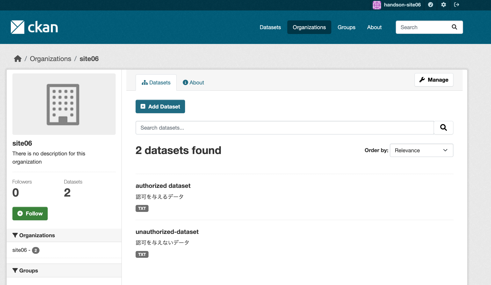
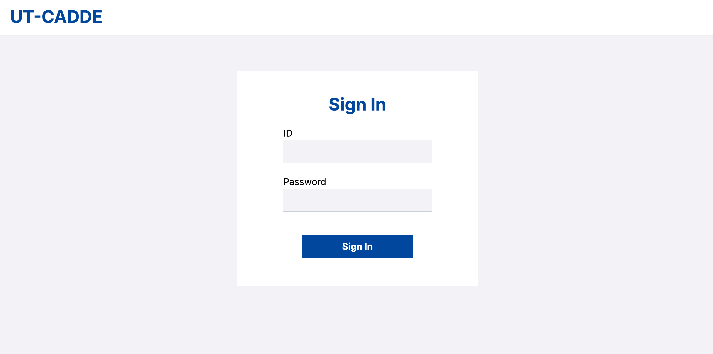
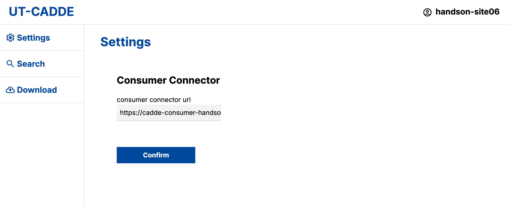
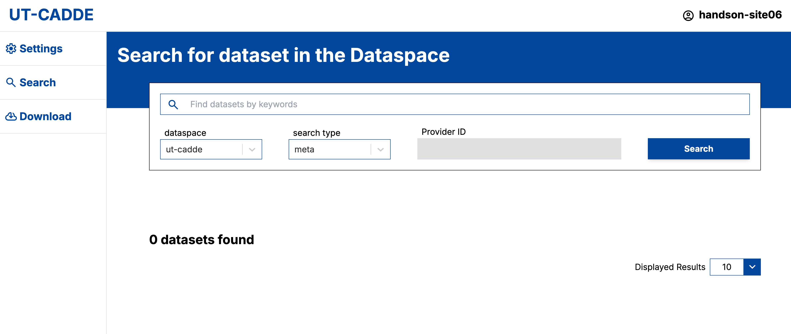
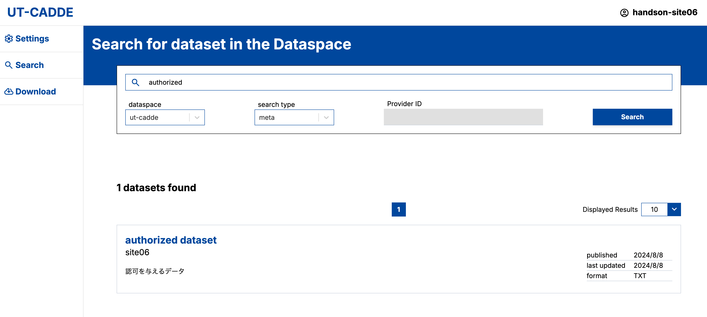
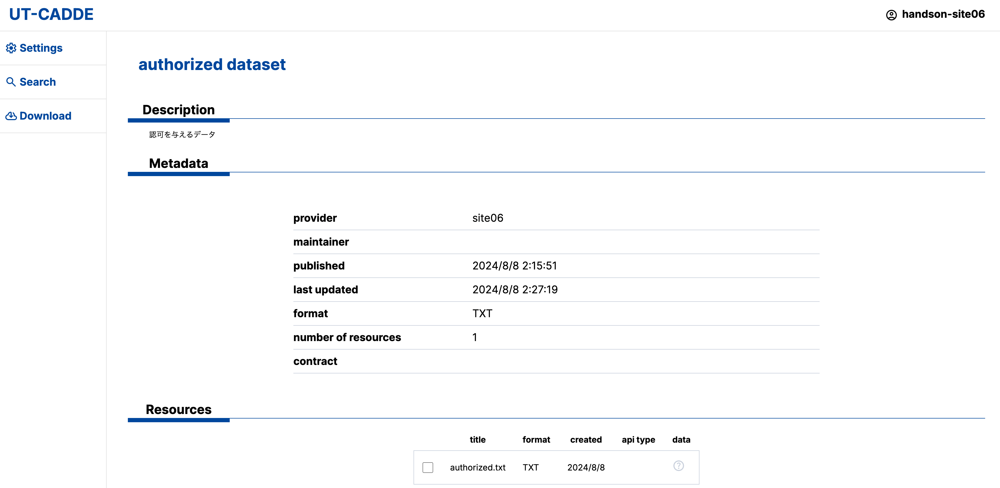
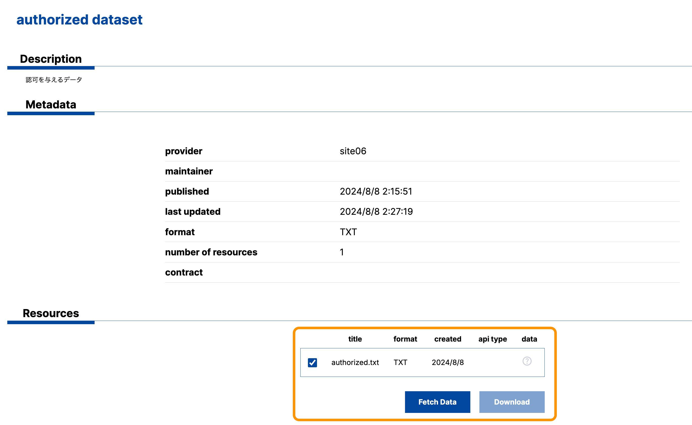
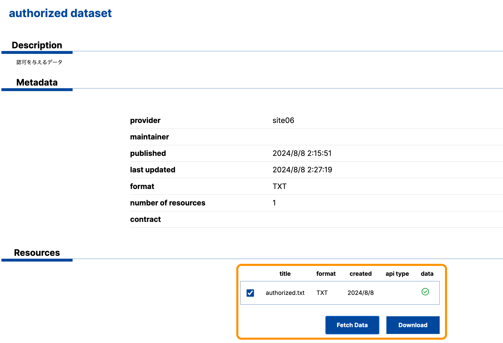
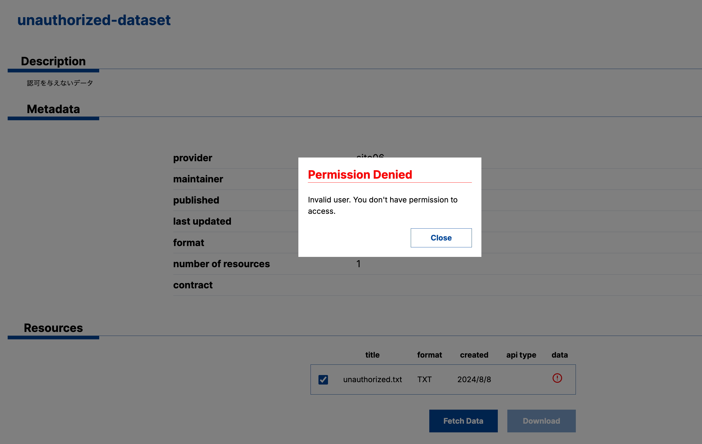

# CADDEテストベッド ハンズオン
本資料は、データスペース技術国際テストベッド「第3回テストベッドTF CADDE4.0ハンズオン」（2024年8月23日）で用いられるものである。

# 目標
本ハンズオンでは、AWS上に構築したハンズオン環境において、データ利用者環境・データ提供者環境をそれぞれ構築し、それらの間でCADDEを通じたデータ検索・取得を達成することを目的とする。

本ハンズオンにおいて、データ提供者はデータ利用者に対して「認可を与えるデータ」「認可を与えないデータ」の2種類を提供するようにすることで、CADDEによる主権的なデータ共有を実践する。

# 前提

## ハンズオン環境について
ハンズオン環境はAWS上に構築され、データスペース技術国際テストベッドに参加している各社ごとに割り当てられる。

ハンズオン環境を構成するホスト情報は以下の通り。
- EC2（t3.medium）：2台
    - OS：Ubuntu 22.04
    - CPU：2コア
    - メモリ：4GB
    - ディスク：40GB

2つの仮想マシンのうち、1つをデータ提供者環境（・WireGuardルータ）、もう1つをデータ利用者環境として構築することとする。

データ提供者環境には以下の4つのアプリケーション用コンテナを構築する。
- HTTPサーバ
- 提供者カタログサイト
- 認可機能
- 提供者コネクタ

データ利用者環境には以下の2つのアプリケーション用コンテナを構築する。
- 利用者コネクタ
- 利用者WebApp


## CADDEテストベッド参加のための事前準備
本来、CADDEテストベッドの利用を開始するためには、各参加者が[CADDEテストベッド参加のための事前準備](./README.md#caddeテストベッド参加のための事前準備)を行うことが必要となる。
具体的な準備事項は以下の通り。
- [CADDEテストベッド利用情報の取得](./README.md#caddeテストベッド利用情報の取得)
- [CADDEテストベッド参加者環境のドメイン登録](./README.md#caddeテストベッド参加者環境のドメイン登録)
- [CADDEテストベッド用TLS証明書の取得](./README.md#caddeテストベッド用tls証明書の取得)

しかし、本ハンズオンでは、CADDE参加者環境の構築・設定・利用方法に焦点を当てるため、これらの準備情報をハンズオン環境用に事前に割り当てる。

そのため、ハンズオン参加者が上記の事前準備を行う必要はない。
下記のハンズオン作業では、東京大学によって割り振られたハンズオン用の事前準備情報（CADDEユーザID、ドメイン名、TLS証明書など）を用いることとする。
<!-- TODO: TLS証明書の場所を示す -->
<!-- TODO：↑上記の情報を割り振る動線を確認 -->


# ハンズオン手順

## 1. 実行環境の準備
CADDE参加者環境の構築・利用は、以下のコマンドおよびソフトウェアが利用可能であることを前提とする。
- docker
- git
- curl
- jq
- openssl

以下にこれらをインストールするための例を示す。

0. （パッケージリストの更新）
    ```bash
    $ sudo apt-get update
    ```

1. docker

    [公式サイト](https://docs.docker.com/engine/install/ubuntu/)を参考にインストールする。
    ```bash
    # Add Docker's official GPG key:
    $ sudo apt-get update
    $ sudo apt-get install ca-certificates curl
    $ sudo install -m 0755 -d /etc/apt/keyrings
    $ sudo curl -fsSL https://download.docker.com/linux/ubuntu/gpg -o /etc/apt/keyrings/docker.asc
    $ sudo chmod a+r /etc/apt/keyrings/docker.asc

    # Add the repository to Apt sources:
    $ echo \
    "deb [arch=$(dpkg --print-architecture) signed-by=/etc/apt/keyrings/docker.asc] https://download.docker.com/linux/ubuntu \
    $(. /etc/os-release && echo "$VERSION_CODENAME") stable" | \
    sudo tee /etc/apt/sources.list.d/docker.list > /dev/null
    $ sudo apt-get update

    $ sudo apt-get install docker-ce docker-ce-cli containerd.io docker-buildx-plugin docker-compose-plugin
    ```

    自分のユーザをdockerグループに追加し、sudoなしでdockerコマンドを実行可能にする。
    シェルにログインし直すことで有効になる。
    ```bash
    $ sudo usermod -aG docker $USER
    ```

1. その他
    ```bash
    $ sudo apt-get install curl git jq openssl
    ```


## 2. CADDE参加者環境の構築
データ提供者環境の構築手順は[provider.md > 1. インストール](./provider.md#1-インストール)を参照する。<br/>
[データ提供設定](./provider.md#2-データ提供設定)については、以降の章（[3. CADDEでデータを提供する](#3-caddeでデータを提供する)）にて具体的に扱う。

データ利用者環境の構築手順は[consumer.md > 1. インストール](./consumer.md#1-インストール)を参照する。


## 3. CADDEでデータを提供する
本章では、データ提供者がコネクタを経由してCADDE上にデータを提供する手順を追う。

### 3.1. データサーバを構築する
はじめに、本CADDEハンズオンでのデータ共有に利用するデータサーバを、提供者コネクタからのみアクセス可能な非公開のHTTPサーバとして構築する。

そのために、データ提供者環境を構築したものと同じホスト上で、HTTPサーバ用Dockerコンテナを起動する。

データサーバを非公開にするためには、データ提供者環境内部の独自ドメインを用いる。
具体的には、データ提供者がHTTPサーバ用Dockerコンテナに対して独自ドメインを割り当て、これを提供者コネクタのみが名前解決できるよう設定する。
その上で、データのアクセスURLに独自ドメインを含めたまま、データカタログを公開するようにする。

#### HTTPサーバ用Dockerコンテナの起動
まず、データ提供者環境のホストにログインした上で、作業用ディレクトリを作成する。
```bash
$ mkdir -p ~/cadde_testbed/private-http-server
```

HTTPサーバ上に保持されるデータを格納するためのディレクトリを作成する。
```bash
$ cd ~/cadde_testbed/private-http-server
$ mkdir data
```

そして、`compose.yml`という名前のファイルを新たに作成し、次の内容に編集する。
```bash
$ cd ~/cadde_testbed/private-http-server
$ vim compose.yml
```
```yaml
services:
    nginx:
      image: nginx:alpine
      ports:
        - "8080:80"
      volumes:
        - ./data:/usr/share/nginx/html
```
なお、コンテナを公開するポート番号（上記では8080番）は各環境に合わせて適宜変更する。

最後に、以下のコマンドを実行し、HTTPサーバ用のDockerコンテナを起動する。
```bash
$ cd ~/cadde_testbed/private-http-server
$ docker compose up -d
```

#### HTTPサーバにデータを配置する
本ハンズオンにおいて、データ提供者はデータ利用者に対して「認可を与えるデータ」「認可を与えないデータ」の2種類を提供するようにすることで、CADDEによる主権的なデータ共有を実践する。

そこで、上記で構築したHTTPサーバ上には認可を与える用・認可を与えない用の2種類のデータを`~/cadde_testbed/private-http-server/data`に配置する。

配置するデータの中身は各ハンズオン参加者が自由に決定できる。

参考として、シンプルなテキストファイルを配置する例を以下に示す。
```bash
$ cd ~/cadde_testbed/private-http-server

$ echo "Authorized by provider-handson-site06." > ./data/authorized.txt
$ echo "Unauthorized by provider-handson-site06." > ./data/unauthorized.txt
```

配置したデータは以下のURL形式で確認できる。
- `http://<ホストのIPアドレス>:8080/<dataディレクトリ以下のパス>`
    - 例：`http://10.250.250.10:8080/authorized.txt`

<!-- - TODO: どういうデータを準備するか -->

#### HTTPサーバ用Dockerコンテナに独自ドメインを割り当てる
データサーバを非公開にするために、Dockerコンテナに対して独自ドメインを割り当て、提供者コネクタから名前解決できるようにする。

そこで、データ提供者環境のホストにログインした上で、提供者コネクタの`docker-compose.yml`を追加で編集する。

まず、提供者コネクタが起動中の状態であれば、一度終了させる。
```bash
$ cd ~/cadde_testbed/klab-connector-v4/src/provider
$ sh stop.sh
```

次に、提供者コネクタのconnector-mainコンテナ内の`/etc/hosts`にデータサーバの独自ドメインとIPアドレスの対応を追加する。

独自ドメインの文字列はハンズオン参加者の環境に合わせて自由に決定する。
下記の例では、テストベッドネットワークで割り振られているsitenameを用いて、`data-management.<sitename>.internal`という形式にしている。

```bash
$ cd ~/cadde_testbed/klab-connector-v4/src/provider
$ vim docker-compose.yml
```
```yaml
services:
  provider-connector-main:
    ...
    extra_hosts:
      - "data-management.<sitename>.internal:host-gateway"
```
なおここでは、データサーバと提供者コネクタが同一IPアドレスのホスト上で構築されていることを前提としている。

独自ドメインの設定が完了すれば、提供者コネクタを再度起動する。
```bash
$ cd ~/cadde_testbed/klab-connector-v4/src/provider
$ sh start.sh
```


### 3.2. データ原本情報を登録する
HTTPサーバに配置した2種類のデータそれぞれの原本情報を来歴管理機能に新たに登録する。

なお、データ原本情報の登録作業の詳細は、[provider.md](./provider.md#21-データ原本情報の登録)を参照する。
また、来歴管理機能APIの詳細な仕様は、[CADDE公式の技術仕様](https://github.com/CADDE-sip/documents)を参照すること。

データ提供者環境のホストにログインした上で、以下のコマンドを実行する。

リクエストボディ1つ目では以下のパラメータを書き換えて設定する。
- `dataprovider`：データ提供者のCADDEユーザID
- `cdluri`：データURL
    - [データサーバの構築](#31-データサーバを構築する)において、データサーバに割り当てた独自ドメインを使って記述する
    - `http://data-management.site06.internal:8080/authorized.txt`

リクエストボディ2つ目では、環境に合わせて提供データファイルの絶対パスを指定する。
- 例：`/home/ubuntu/cadde_testbed/private-http-server/data/authorized.txt`

```bash
$ json_temp_file=$(mktemp)

# 1つ目のリクエストボディ作成
$ echo '{"cdldatamodelversion": "2.0", "cdleventtype": "Create", "dataprovider": "データ提供者のCADDEユーザID", "cdldatatags": [{"cdluri": "データURL"}]}' > "$json_temp_file"

# 原本情報登録リクエスト
$ curl -v -sS -X POST "http://cadde-provenance-management.koshizukalab.dataspace.internal:3000/v2/eventwithhash" \
-F "request=@$json_temp_file;type=application/json" \
-F "upfile=@<提供データファイルのパス>;type=text/plain" \
| jq '.'
```

データ原本情報の登録リクエストに成功すると、データ原本情報の登録イベントを識別するIDが返される。
このIDは[3.3. データカタログを作成する](#33-データカタログを作成する)で用いるため、記録しておく。
```json
{
  "cdleventid": "XXX"
}
```

HTTPサーバに配置した2種類のデータそれぞれについて、原本情報の登録が成功すれば完了である。


### 3.3. データカタログを作成する
HTTPサーバに配置した2種類のデータについて、提供者カタログサイト上でそれぞれ別のデータセットとしてカタログを作成する。

詳細な手順は[provider.md > 2.2. データカタログの作成](./provider.md#22-データカタログの作成)を参照する。

以下のように2種類のデータそれぞれについてデータカタログを作成できれば完了である。




### 3.4. 認可を設定する
先述の通り、本ハンズオンではデータ利用者に対して「認可を与えるデータ」「認可を与えないデータ」の2種類を提供する。

したがって、HTTPサーバに配置した2種類のデータの認可設定を行う。

2種類のデータそれぞれについて、設定する認可の条件は以下の通り。
- 認可を与えるデータ
    - リソースURL
        - 「認可を与えるデータ」のURL
        - 例：`http://data-management.site06.internal:8080/authorized.txt`
    - ユーザに対する認可
        - 自分のハンズオン用CADDEユーザIDを指定する
- 認可を与えないデータ
    - リソースURL
        - 「認可を与えないデータ」のURL
        - 例：`http://data-management.site06.internal:8080/authorized.txt`
    - ユーザに対する認可
        - 自分のハンズオン用CADDEユーザID以外の適当な文字列を指定する

認可を設定するための詳細な手順は、[provider.md > 2.3. 認可の設定](./provider.md#23-認可の設定)を参照する。


### 3.5. 提供者コネクタとデータサーバを接続する
HTTPサーバに配置した2種類のデータのロケーションを提供者コネクタに設定する。

詳細な手順は[provider.md > 2.4. データサーバの接続設定](./provider.md#24-データサーバの接続設定)を参照する。

データ提供者環境のホストにログインした上で、以下のファイルを編集する。
- `klab-connector-v4/src/provider/connector-main/swagger_server/configs/http.json`

このとき、設定するデータのURLは、データ原本情報の登録・データカタログの作成の際と同じく、HTTPサーバに割り当てた独自ドメインを使って記述することに注意する。

以下に設定例を示す。
データURLは各自の環境に応じて適宜設定する。
```json
"authorization": [
    {
        "url": "http://data-management.site06.internal:8080/authorized.txt",
        "enable": true
    },
    {
        "url": "http://data-management.site06.internal:8080/unauthorized.txt",
        "enable": true
    }
],
"contract_management_service": [
    {
        "url": "http://data-management.site06.internal:8080/authorized.txt",
        "enable": false
    },
    {
        "url": "http://data-management.site06.internal:8080/unauthorized.txt",
        "enable": false
    }
],
"register_provenance": [
    {
        "url": "http://data-management.site06.internal:8080/authorized.txt",
        "enable": true
    },
    {
        "url": "http://data-management.site06.internal:8080/unauthorized.txt",
        "enable": true
    }
]
```


## 4. CADDEでデータを取得する
本章では、データ利用者が利用者WebApp・利用者コネクタを介して、CADDEからデータを取得する手順を追う。

### 4.1. ユーザ認証
利用者WebAppトップページからハンズオン用のCADDEユーザID・パスワードを入力してログインする。



このとき、背後では利用者WebAppが認証機能にリクエストを行なってCADDE利用者トークンを取得している。
CADDE利用者トークンはCADDEユーザに関する情報を含んでおり、後述する詳細検索やデータ取得における認可判断に利用される。

ログインに成功すると次の画面に遷移する。

ここでWebAppが接続先とする利用者コネクタURLを指定し、`Confirm`を押す。
- 例：`https://cadde-consumer-handson.site06.dataspace.internal:443/`




### 4.2. 横断検索によってデータを発見する
利用者WebApp画面左側のメニューから`Search`を選択し、次のデータ検索画面に遷移する。



画面上部の検索窓に[作成したデータカタログ](#33-データカタログを作成する)のタイトルやデータURLなどの情報を一部入力して検索する。

ここで`search_type`の欄の`meta`という値が、データカタログの横断検索リクエストを行うことを示している。
このとき、背後では利用者WebAppが横断検索機能にリクエストを行なってクローリングされたデータカタログの一覧を取得している。

検索結果が表示され、データカタログページに遷移して情報を確認することができれば完了である。

以下に画面例を示す。





<!-- ### 4.3. 詳細検索によってデータカタログを取得する -->
<!-- ここでは

利用者WebApp画面左側のメニューから`Search`を選択し、次のデータ検索画面に遷移する。


画面上部の検索窓に[作成したデータカタログ](#33-データカタログを作成する)のタイトルやデータURLなどの情報を一部入力して検索する。

ここで`search_type`の欄の`meta`という値が、データカタログの横断検索リクエストを行うことを示している。
このとき、背後では利用者WebAppが横断検索機能にリクエストを行なってクローリングされたデータカタログの一覧を取得している。

検索結果が表示され、データカタログページに遷移して情報を確認することができれば完了である。

以下に画面例を示す。


 -->


### 4.3. データ提供者からデータを取得する
ここでは実際にデータ提供者からCADDEを介して認可付きのデータを取得する手順を示す。

データ検索結果から、認可ありのデータカタログページに遷移し、取得したいリソースにチェックを入れる。



この状態で`Fetch Data`を押すと、背後で利用者WebAppが提供者コネクタに対してデータ取得リクエストを送信し、データファイルを取得する。
データ提供者環境で、データ利用者に対するデータアクセスが認可されれば、実際にデータが転送される。
その結果、取得できたリソースに緑色のチェックマークが表示される。



この状態で`Download`を押せば、ブラウザにデータがダウンロードされ、CADDEを通じたデータ転送が完了する。

一方で、認可なしのデータカタログページに遷移し、`Fetch Data`を押すと、以下のエラーメッセージが表示される。



これは、データ提供者環境で、当該データに対するアクセスが認可されていないことを示すものである。

以上、2種類のデータに対してデータ取得リクエストを行い、認可の有無による挙動の違いを確認したことで、CADDEによる主権的なデータ共有を実現できたと言える。


## 5. CADDE上のデータの来歴を確認する
最後に、データ提供者・データ利用者がCADDE上で共有されたデータの来歴（データ交換・加工の履歴）を確認する手順を追う。
ここでは、認可を与えるデータ、認可を与えないデータそれぞれに対して来歴を確認する。

データの来歴を確認するためには、来歴管理機能の来歴確認APIを利用する。

なお、データ原本情報の登録作業の詳細は、[provider.md](./provider.md#21-データ原本情報の登録)を参照する。
また、来歴管理機能APIの詳細な仕様は、[CADDE公式の技術仕様](https://github.com/CADDE-sip/documents)を参照すること。

来歴確認APIの実行例は以下の通り。

パスパラメータにデータの原本情報を登録した際に得られるイベントIDを指定する。

```bash
$ curl -v -sS "http://cadde-provenance-management.koshizukalab.dataspace.internal:3000/v2/lineage/<原本情報登録イベントID>?direction=BOTH&depth=-1" | jq '.'
```

APIの実行に成功すると、認可を与えるデータについては以下のような3つのJSONオブジェクトが入ったリストが返される。
```json
[
  {
    "cdldatamodelversion": "2.0",
    "cdldatatags": [
      {
        "cdlsha256hash": "c38653b18b0f815ba7d5d08f86a66aa8d2a3250e9f2c858b57cbeff6b5201264",
        "cdluri": "http://data-management.site06.internal:8080/authorized.txt"
      }
    ],
    "cdleventid": "f16e3276-8726-4a12-a537-1befef69d9ca",
    "cdleventtype": "Create",
    "cdlnextevents": [
      "e7db1c00-cbd6-44a4-86b2-0926965b3909"
    ],
    "cdlorganization": "org01.cdl.com",
    "cdlpreviousevents": [],
    "cdltimestamp": "2024-08-07T19:29:38.949Z",
    "dataprovider": "handson-site06"
  },
  {
    "cdldatamodelversion": "2.0",
    "cdleventid": "e7db1c00-cbd6-44a4-86b2-0926965b3909",
    "cdleventtype": "Sent",
    "cdlnextevents": [
      "91d25340-f184-447d-9793-207fa65b90e2"
    ],
    "cdlorganization": "org01.cdl.com",
    "cdlpreviousevents": [
      "f16e3276-8726-4a12-a537-1befef69d9ca"
    ],
    "cdltimestamp": "2024-08-08T03:10:01.792Z",
    "dataprovider": "handson-site06",
    "datauser": "handson-site06"
  },
  {
    "cdldatamodelversion": "2.0",
    "cdleventid": "91d25340-f184-447d-9793-207fa65b90e2",
    "cdleventtype": "Received",
    "cdlnextevents": [],
    "cdlorganization": "org01.cdl.com",
    "cdlpreviousevents": [
      "e7db1c00-cbd6-44a4-86b2-0926965b3909"
    ],
    "cdltimestamp": "2024-08-08T03:10:03.909Z",
    "dataprovider": "handson-site06",
    "datauser": "handson-site06"
  }
]
```

これらの値は`cdleventtype`で区別されており、それぞれ以下のデータ交換・加工の履歴を示す。
- `Create`
    - データ原本情報の登録
    - データ提供準備時に作成
- `Sent`
    - データ送信履歴
    - データ取得リクエストが認可された場合に提供者コネクタが自動で作成
- `Received`
    - データ受信履歴
    - データ取得リクエストが成功した場合に利用者コネクタが自動で作成

一方、認可を与えないデータについては、以下のようにデータ原本情報の登録イベントだけが格納されたリストが返される。

```json
[
  {
    "cdldatamodelversion": "2.0",
    "cdldatatags": [
      {
        "cdlsha256hash": "daa99d24e9df77ebc8756a34b61bb34cb621951f37b489c30bc448ad28eb5ba8",
        "cdluri": "http://data-management.site06.internal:8080/unauthorized.txt"
      }
    ],
    "cdleventid": "3d7bbfcf-3764-4937-b106-f1b14fa01416",
    "cdleventtype": "Create",
    "cdlnextevents": [],
    "cdlorganization": "org01.cdl.com",
    "cdlpreviousevents": [],
    "cdltimestamp": "2024-08-07T19:37:02.613Z",
    "dataprovider": "handson-site06"
  }
]
```
