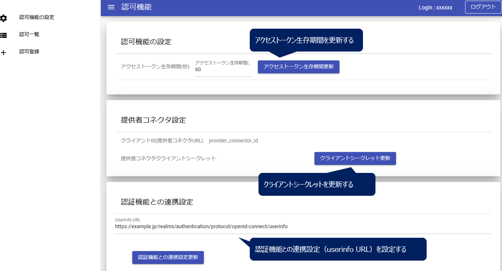

# データ提供者環境の構築

# 前提

## CADDEテストベッド参加のための事前準備

CADDEテストベッドの利用開始にあたって、テストベッド参加者は[CADDEテストベッド参加のための事前準備](./README.md#caddeテストベッド参加のための事前準備)を行う必要がある。

以降のデータ提供者環境の構築にあたっては、以下の作業が完了していることを前提とする。
- [CADDEテストベッド利用情報の取得](./README.md#caddeテストベッド利用情報の取得)
- [CADDEテストベッド参加者環境のドメイン登録](./README.md#caddeテストベッド参加者環境のドメイン登録)
- [CADDEテストベッド用TLS証明書の取得](./README.md#caddeテストベッド用tls証明書の取得)


## 実行環境
<!-- TODO: 詳細に記述する -->
データ提供者環境を構築するマシンは以下の条件を満たすことを前提とする。
- OS：Linux
- CPU：2コア
- メモリ：4GB
- ディスク：20GB

また、以下のコマンドおよびソフトウェアが利用可能であることを前提とする。
- curl
- jq
- git
- docker
- openssl


## 提供データ
データ提供者環境は、CADDE上で提供するためのデータおよびデータを保管するデータサーバが存在することを前提とする。

CADDE上で提供されるデータについて、提供者コネクタでは以下のデータサイズを満たすデータのみがサポートされている。
- コンテキスト情報：1MB 以下
- ファイル：100MB 以下

また、データサーバは、HTTP / FTP / NGSIのいずれかのプロトコルによって提供者コネクタからアクセス可能であることを前提とする。
なお、CADDEテストベッドではデータサーバとしてHTTPサーバを構築することを推奨する。

データサーバは提供者コネクタからアクセス可能であれば、公開サーバ・非公開サーバのどちらでもよい。
基本的には、データ提供時の認可が不要であれば公開サーバ、認可を必要とするなら非公開サーバとする使い分けが一般的である。


# 1. インストール

データ提供者環境では、以下3つのアプリケーションを構築する。
- 提供者カタログサイト
- 認可機能
- 提供者コネクタ

はじめに、これ以降の作業を行うディレクトリを作成し、以降のコマンドでは環境変数${WORKDIR}で参照することとする。
```bash
$ mkdir ~/cadde_testbed
$ cd ~/cadde_testbed
$ export WORKDIR=$PWD
```

## 1.1. 提供者カタログサイト

### 1.1.1. CKANの構築
[CKAN公式ドキュメントのインストール手順](https://docs.ckan.org/en/2.10/maintaining/installing/index.html)に従い、CKANサイトを構築する。

（参考：[CKANの推奨動作環境](https://github.com/ckan/ckan/wiki/Hardware-Requirements)）

以下では参考として、Docker Composeを用いた構築手順を示す。

まず、GitHubからDockerを用いたCKAN構築用のリポジトリをクローンする。
```bash
$ cd ${WORKDIR}
$ git clone https://github.com/ckan/ckan-docker.git
```

`.env`ファイル内で、以下の環境変数を設定する。
- `NGINX_SSLPORT_HOST`
  - CKANコンテナを公開するポート番号
- `CKAN_SITE_URL`
  - CKANサイトのアクセスに用いるURL
  - CADDEテストベッド参加の事前準備で取得しておいた提供者カタログサイトのドメイン名を用いる
- `CKAN_SYSADMIN_NAME`
  - CKANサイト管理者のユーザ名
- `CKAN_SYSADMIN_PASSWORD`
  - CKANサイト管理者のパスワード（英数字8文字以上）

```bash
$ cd ${WORKDIR}/ckan-docker
$ cp .env.example .env
$ vim .env
# Host Ports
NGINX_SSLPORT_HOST=<ポート番号>
...
# CKAN core
CKAN_SITE_URL=https://<提供者カタログサイトのドメイン>:<ポート番号>
...
CKAN_SYSADMIN_NAME=<CKAN管理者のユーザ名>
CKAN_SYSADMIN_PASSWORD=<CKAN管理者のパスワード>
```

次に、提供者カタログサイトのTLSサーバ証明書・秘密鍵をCKANのリバースプロキシに配置する。

配置先は`ckan-docker/nginx/setup`というディレクトリである。

なお、リポジトリからクローンした段階で、すでに`ckan-local.key`、`ckan-local.crt`というファイル名で秘密鍵・TLSサーバ証明書がそれぞれ存在している。
そのため、これらのファイルをCADDEテストベッド参加用の秘密鍵・TLSサーバ証明書で置き換える（ファイル名は同一のものにする）。

ディレクトリが以下の状態になれば完了である。
```bash
$ ls ${WORKDIR}/ckan-docker/nginx/setup/
ckan-local.crt  ckan-local.key  default.conf  index.html  nginx.conf
```

そして、CKANのリバースプロキシ用コンテナのDockerfile（`ckan-docker/nginx/Dockerfile`）を以下の内容に書き換える。
```dockerfile
FROM nginx:stable-alpine

ENV NGINX_DIR=/etc/nginx

RUN apk update --no-cache && \
    apk upgrade --no-cache && \
    apk add --no-cache openssl

COPY setup/nginx.conf ${NGINX_DIR}/nginx.conf
COPY setup/index.html /usr/share/nginx/html/index.html
COPY setup/default.conf ${NGINX_DIR}/conf.d/

RUN mkdir -p ${NGINX_DIR}/certs

COPY setup/ckan-local.crt ${NGINX_DIR}/certs/ckan-local.crt
COPY setup/ckan-local.key ${NGINX_DIR}/certs/ckan-local.key

ENTRYPOINT nginx -g 'daemon off;'
```

最後に、以下のコマンドを実行し、提供者カタログCKAN用のDockerコンテナ群を起動する。
```bash
$ cd ${WORKDIR}/ckan-docker
$ docker compose build
$ docker compose up -d
```

提供者カタログの起動状況は以下のコマンドで確認できる。
6つのコンテナすべてが立ち上がっていれば完了である。
```bash
$ cd ${WORKDIR}/ckan-docker
$ docker compose ps
```


### 1.1.2. CKANの初期設定
[CKAN公式ドキュメントの初期設定手順](https://docs.ckan.org/en/2.10/maintaining/getting-started.html)に従い、CKANの初期設定を行う。

#### ユーザの作成
CKANの起動直後は管理者用アカウントしか存在しない。

そこで、CKANサイト上でデータ提供者に対応する新たなユーザを作成する。

新たなユーザを作成する場合、まず提供者カタログサイトに管理者としてログインする。


その後、`https://<CKANサイトドメイン>:<ポート番号>/user/register`というエンドポイントにアクセスすると、ユーザ作成画面に遷移する。
この画面上で、ユーザ名・パスワードを設定し、データ提供者に対応するユーザを作成する。


なお、CKAN上のユーザ名・パスワードは必ずしもCADDEユーザのユーザ名・パスワードと一致していなくともよいが、同じものを設定することを推奨する。
また、ユーザ作成時に入力するメールアドレスについては、メールサーバと連携しない場合には不要であるため、適当な文字列を入力すればよい。

`https://<CKANサイトドメイン>:<ポート番号>/user`にアクセスして、作成したユーザが一覧に含まれていることを確認できれば完了である。


#### 組織（Organization）の作成
CKANではデータカタログを組織単位（Organizations）でまとめることができる。

そこで、CKANサイト上でCADDEテストベッドに参加している組織（WireGuardサイト）に対応する新たな組織を作成する。

新たな組織を作成する場合、[上記](#ユーザの作成)で作成したユーザでCKANサイトにログインする（管理者アカウントでないことに注意）。

その後、画面上部`Organizations`メニューに遷移し、`Add Organization`から新たな組織を作成する。


組織情報の入力画面では、組織名として各WireGuardサイトのsitenameに対応する英文字列を入力することを推奨する。
例えば、東京大学越塚研究室のWireGuardサイト上で構築されるデータ提供者環境では、`koshizukalab`を入力する。
また、組織の説明欄（Description）は任意で入力すればよい。


画面上部`Organizations`メニューに遷移し、作成した組織が一覧に含まれていることを確認できれば完了である。


#### CKAN APIキーの作成
一部のCKAN APIを利用するためには、CKAN APIキーが必要となる。

以下にCKAN APIキーの取得手順を示す。

まず、CKANサイトにユーザログインした状態で、画面右上からユーザページに遷移する。


次にユーザページ上部のメニューから`API Tokens`を選択し、発行するAPIキーの名前を入力する。


`Create API Token`を押すと、新たなAPIキーが発行される。
このAPIキーはこの画面でしか表示されないため、後で利用するために記録しておく。


### 1.1.3. CKANの動作確認
<!-- TODO -->

#### via GUI
CKAN公式ドキュメント[User guide > Using CKAN](https://docs.ckan.org/en/2.10/user-guide.html#using-ckan)を参考に、CKAN上で新しいカタログの作成や既存のカタログの検索ができるか確認する。

#### via API
CKAN公式ドキュメント[API guide](https://docs.ckan.org/en/2.10/api/index.html)を参考に、APIを通じて以下を実行できるか確認する。
- カタログ一覧の取得
  - `/api/action/package_list`
- 指定したカタログの取得
  - `/api/action/package_show?id=<カタログID>`
- カタログの検索
  - `/api/action/package_search?q=<検索キーワード>`


<!-- ### 1.1.4. 横断検索機能への登録申請 -->
<!-- TODO -->

<!-- 横断検索機能が提供者カタログサイトをクローリング対象として登録するための申請を行う。

横断検索機能は東京大学越塚研究室が管理しているため、CADDEテストベッド参加者は以下の情報を越塚研究室の担当者に送付する。
- 提供者カタログサイト名
  - 例：`越塚研究室カタログサイト`
- 提供者カタログサイトのドメイン名
  - 例：`cadde-catalog-test1.koshizukalab.dataspace.internal`

横断検索機能の登録完了通知を受け取り、横断検索サイト上で自身が提供するデータカタログの閲覧・検索ができることを確認できれば完了である。 -->


## 1.2. 認可機能

### 1.2.1. ソースコードの取得
GitHubからCADDEコネクタリポジトリをクローンする。

```bash
$ cd ${WORKDIR}
$ git clone https://github.com/Koshizuka-lab/klab-connector-v4.git
$ cd klab-connector-v4
$ git switch testbed
```

ブランチが`testbed`であることを確認する。
```bash
$ git branch
  main
* testbed
```

`klab-connector-v4/misc/authorization`に認可機能用ソースコードが配置してある。


### 1.2.2. Dockerイメージの作成
認可機能を構成するFastAPIコンテナおよびKeycloakコンテナのDockerイメージを作成する。
```bash
$ cd ${WORKDIR}/klab-connector-v4/misc/authorization
$ ./image_build_fastapi.sh
$ ./image_build_keycloak.sh
```

以下のコマンドでDockerイメージが作成されたことを確認する。
FastAPIコンテナは`fastapi:latest`、Keycloakコンテナは`prebuild_keycloak:19.0.2`という名前のイメージを用いている。
```bash
$ sudo docker image ls | grep fastapi
$ sudo docker image ls | grep keycloak
```


### 1.2.3. 認可用Keycloakの初期設定
以下のファイルを編集し、認可用Keycloakのユーザに関する初期設定を行う。
- `klab-connector-v4/misc/authorization/docker-compose.yaml`

設定すべきパラメータは以下の通り。
- services
  - nginx
    - `ports`：認可機能を公開するポート番号
  - keycloak
    - environment
      - `KEYCLOAK_ADMIN`：認可用Keycloakの管理者ユーザ名
      - `KEYCLOAK_PASSWORD`：認可用Keycloakの管理者パスワード
      - `KC_DB_USERNAME`：認可用Keycloakが利用するDBのユーザ名
      - `KC_DB_PASSWORD`：認可用Keycloakが利用するDBのパスワード
  - postgres
    - environment
      - `POSTGRES_USER`：PostgresDBのユーザ名
        - 上記`KC_DB_USERNAME`と一致させる
      - `POSTGRES_PASSWORD`：PostgresDBのパスワード
        - 上記`KC_DB_PASSWORD`と一致させる

<!-- 
| 設定パラメータ                     | 概要                                  |
| :------------------------------ | :----------------------------------- |
| services.nginx.ports | 認可機能ポート番号 |
| services.keycloak.environment.KEYCLOAK_ADMIN | 認可機能Keycloakのadminユーザ名 |
| services.keycloak.environment.KEYCLOAK_PASSWORD | 認可機能Keycloakのadminユーザパスワード |
| services.keycloak.environment.KC_DB_USERNAME | 認可機能Keycloakが利用するPostgresDBのユーザ名 |
| services.keycloak.environment.KC_DB_PASSWORD | 認可機能Keycloakが利用するPostgresDBのパスワード |
| services.postgres.environment.POSTGRES_USER | PostgresDBのユーザ名（KC_DB_USERNAMEと一致させる）　|
| services.postgres.environment.POSTGRES_PASSWORD | PostgresDBのパスワード（KC_DB_PASSWORD）と一致させる　| -->

以下に設定例を示す。
```yaml
services:
  nginx:
    ports:
      - "5080:80"
    ...
  keycloak:
    ...
    environment:
      KEYCLOAK_ADMIN: admin
      KEYCLOAK_ADMIN_PASSWORD: admin
      ...
      KC_DB_USERNAME: keycloak
      KC_DB_PASSWORD: keycloak
      ...
  postgres:
    ...
    environment:
      ...
      POSTGRES_USER: keycloak
      POSTGRES_PASSWORD: keycloak
```

### 1.2.4. 認証機能との連携に関する設定
認可機能は認証機能と連携することで、データ利用者の認証トークンからCADDEユーザ情報を取得し、認可判断を行う。

そこで、認証機能の接続先URLや、認証機能から見た認可機能のクライアント設定を以下の設定ファイルに記載する。
- `klab-connector-v4/misc/authorization/settings.json`

設定すべきパラメータは以下の通り。

| 設定パラメータ | 概要 |
| :---------- | :-- |
| provider_connector_id　| 提供者コネクタのクライアントID（認可機能発行） |
| client_id | 認可機能のクライアントID |
| client_secret | 認可機能のクライアントシークレット |
| authz_keycloak_url | 認可機能KeycloakのベースURL |
| authn_url | 認証機能APIのベースURL |
| authn_keycloak_url | 認証機能KeycloakのベースURL |
| authn_realm_name | 認証機能のレルム名（authenticationに固定） |
| subject_issuer | 認証機能を表す文字列（authenticationに固定） |

以下に設定例を示す。
```json
{
  "provider_connector_id": "provider-test1",
  "client_id": "authz-test1",
  "client_secret": "XXX",
  "authz_keycloak_url": "http://cadde-authz-test1.koshizukalab.dataspace.internal:5080/keycloak",
  "authn_url": "https://cadde-authn.koshizukalab.dataspace.internal:18443/cadde/api/v4",
  "authn_keycloak_url": "https://cadde-authn.koshizukalab.dataspace.internal:18443/keycloak",
  "authn_realm_name": "authentication",
  "subject_issuer": "authentication"
}
```

<!-- また、認証機能との連携に伴い、認可機能上で認証機能のサーバ証明書を信頼するための設定を行う必要がある。

まず、認証機能のCA証明書を配置するためのディレクトリを作成する。
```bash
$ mkdir ${WORKDIR}/klab-connector-v4/misc/authorization/certs
```

上のディレクトリに認証機能のCA証明書を配置する。
この証明書は、CADDEテストベッド参加の事前準備の段階で、`cacert.pem`というファイル名で受け取っていることを前提とする（[certificate.mdを参照](./certificate.md)）。

ディレクトリが以下の状態になれば完了である。
```bash
$ ls ${WORKDIR}/klab-connector-v4/misc/authorization/certs
cacert.pem
``` -->

<!-- 次に、認証機能FastAPIコンテナおよびKeycloakコンテナ内部にCA証明書を配置するための設定を以下のファイルで行う。
- `klab-connector-v4/misc/authorization/docker-compose.yml`

設定すべきパラメータは以下の通り。
- services
  - fastapi
    - volumes：CA証明書をコンテナ内にマウント
    - environment
      - `REQUESTS_CA_BUNDLE`：PythonのHTTPリクエスト時に信頼するCA証明書
  - keycloak
    - volumes：CA証明書（pkcs12形式）をコンテナ内にマウント
    - environment
      - `KC_SPI_TRUSTSTORE_FILE_FILE`
      - `KC_SPI_TRUSTSTORE_FILE_PASSWORD`
      - `KC_SPI_TRUSTSTORE_FILE_HOSTNAME_VERIFICATION_POLICY`
      - `KC_SPI_TRUSTSTORE_FILE_TYPE`
    - entrypoint：Keycloakコンテナ起動時に実行されるコマンド
      - CA証明書（PEM形式）からCA証明書（PKCS#12形式）に変換した後、Keycloakを起動するコマンドを記述
    - command：使用しないためコメントアウトする

以下に設定例を示す。
```yaml
services:
  fastapi:
    volumes:
      - "./certs/cacert.pem:/etc/docker/certs.d/cacert.pem:ro"
    environment:
      - REQUESTS_CA_BUNDLE=/etc/docker/certs.d/cacert.pem

  keycloak:
    volumes:
      - "./certs/cacert.pem:/opt/keycloak/cacert.pem:ro"
    environment:
      KC_SPI_TRUSTSTORE_FILE_FILE: cacert.p12
      KC_SPI_TRUSTSTORE_FILE_PASSWORD: testbed
      KC_SPI_TRUSTSTORE_FILE_HOSTNAME_VERIFICATION_POLICY: WILDCARD
      KC_SPI_TRUSTSTORE_FILE_TYPE: pkcs12
    entrypoint: >
      /bin/bash -c "keytool -import -noprompt -file cacert.pem -keystore cacert.jks -storepass testbed
      && keytool -importkeystore -noprompt -srckeystore cacert.jks -srcstorepass testbed -destkeystore cacert.p12 -deststoretype PKCS12 -deststorepass testbed
      && /opt/keycloak/bin/kc.sh start-dev"
    # command: start-dev
``` -->


### 1.2.5. 認可機能の起動
<!-- TODO: 提供者コネクタより後に起動する -->
以下のコマンドを実行し、認可機能用のDockerコンテナ群を起動する。
```bash
$ cd ${WORKDIR}/klab-connector-v4/misc/authorization
$ sh ./start.sh
```

認可機能の起動状況は以下のコマンドで確認できる。
4つのコンテナすべてが立ち上がっていれば、認可機能の起動は完了である。
```bash
$ cd ${WORKDIR}/klab-connector-v4/misc/authorization
$ docker compose ps
```

### 1.2.6. 認可機能の初期セットアップ
認可機能を起動したのち、認可機能の利用ユーザや認証機能との連携に関する初期設定を行う必要がある。

なお、初期設定の内容はDockerボリュームに保存されるため、同じボリューム上ですでに初期設定を行っていれば、再度この手順に従う必要はない。

`provider_setup.sh`を実行し、以下の設定項目を対話的に入力する。

| 設定パラメータ | 概要 |
| :---------- | :-- |
| CADDEユーザID　| データ提供者のCADDEユーザID |
| 提供者コネクタのクライアントID | `settings.json`の`provider_connector_id`の値と一致 |
| CADDE認証機能認証サーバのURL | `settings.json`の`authn_keycloak_url`の値と一致 |

以下に初期セットアップの実行例を示す。
```bash
$ cd ${WORKDIR}/klab-connector-v4/misc/authorization
$ bash ./provider_setup.sh
CADDEユーザID: test1
提供者コネクタのクライアントID: provider-test1
CADDE認証機能認証サーバのURL: https://cadde-authn.koshizukalab.dataspace.internal:18443/keycloak
```

次のようなメッセージが出力されていれば、正常に初期セットアップが行われたこととなる。
```bash
〇レルムtest1の作成に成功しました
〇クライアントprovider-test1の作成に成功しました
〇アイデンティティプロバイダーの作成に成功しました　Userinfo URL: https://cadde-authn.koshizukalab.dataspace.internal:18443/keycloak/realms/authentication/protocol/openid-connect/userinfo
```

最後に、入力した設定項目が`settings_provider_setup.json`に記入されていることを確認する。
```bash
$ cd ${WORKDIR}/klab-connector-v4/misc/authorization
$ cat settings_provider_setup.json
```

### （参考）認可機能の停止
認可機能を停止したい場合は、以下のコマンドを実行する。
```bash
$ cd ${WORKDIR}/klab-connector-v4/misc/authorization
$ sh ./stop.sh
```


## 1.3. 提供者コネクタ

### 1.3.1. ソースコードの取得
※ [認可機能構築時](#12-認可機能)にCADDEコネクタリポジトリをクローンしていれば再度取得する必要はない。

GitHubからCADDEコネクタリポジトリをクローンする。

```bash
$ cd ${WORKDIR}
$ git clone https://github.com/Koshizuka-lab/klab-connector-v4.git
$ cd klab-connector-v4
$ git switch testbed
```

ブランチが`testbed`であることを確認する。
```bash
$ git branch
  main
* testbed
```

`klab-connector-v4/src/provider`に提供者コネクタ用ソースコードが配置してある。

### 1.3.2. 共通ファイルの展開
`setup.sh`を実行する。
```bash
$ cd ${WORKDIR}/klab-connector-v4/src/provider
$ sh setup.sh
```

### 1.3.3. リバースプロキシの設定

提供者コネクタに対する通信はHTTPSによる接続が推奨される。
また、CADDEはデータ共有の信頼性を高めるため、利用者コネクタ - 提供者コネクタ間の相互TLS通信をサポートしている。
そこで、リバースプロキシ上でTLSサーバ証明書の設定を行う。

#### 秘密鍵・サーバ証明書の準備
[certificate.md](certificate.md)に基づき、CADDEテストベッド参加サイト用の秘密鍵とワイルドカード証明書のペアを作成する。

秘密鍵とワイルドカード証明書の作成後、それらを配置するためのディレクトリを作成する。
このディレクトリはリバースプロキシ用Dockerコンテナにマウントされる。

```bash
$ mkdir ${WORKDIR}/klab-connector-v4/src/provider/nginx/volumes/ssl
```

上で作成したディレクトリに秘密鍵とワイルドカード証明書のファイルをそれぞれ`server.key`、`server.crt`というファイル名で配置する
（ただし、これらのファイル名はNginxの設定ファイルを編集することで変更可能）。

<!-- なお、秘密鍵・ワイルドカード証明書はいずれもリバースプロキシ用コンテナ内部にマウントされるため、コンテナ内のユーザから読み取りできるようにファイルのアクセス権限を変更しておく。
```bash
$ chmod +r ${WORKDIR}/klab-connector-v4/src/provider/nginx/volumes/ssl/server.key
$ chmod +r ${WORKDIR}/klab-connector-v4/src/provider/nginx/volumes/ssl/server.crt
``` -->

ディレクトリが以下の状態になれば完了である。
```bash
$ ls -l ${WORKDIR}/klab-connector-v4/src/provider/nginx/volumes/ssl
total 20
-rw-r--r-- 1 ubuntu ubuntu 6200 Aug  7 02:56 server.crt
-rw-r--r-- 1 ubuntu ubuntu 3272 Aug  7 02:56 server.key
```

#### クライアント認証用CA証明書の準備
利用者コネクタ - 提供者コネクタ間の相互TLS通信では、利用者コネクタのクライアント認証を行う。
そのため、リバースプロキシに利用者コネクタが提示するクライアント証明書のCA証明書を、秘密鍵・サーバ証明書を配置したディレクトリと同じ場所に配置しておく。

CADDEテストベッド上のサーバ証明書は、すべてテストベッド用プライベート認証局（越塚研管理）から発行される。
プライベート認証局のルート証明書は、ワイルドカード証明書の発行と同時に`cacert.pem`というファイル名で受け取っていることを前提とする。

ディレクトリが以下の状態になれば完了である。
```bash
$ ls ${WORKDIR}/klab-connector-v4/src/provider/nginx/volumes/ssl
cacert.pem server.crt  server.key
```


### 1.3.4. データカタログの接続設定
詳細検索カタログをコネクタ経由で公開するため、詳細検索カタログのCKANサイトURLを以下のファイルに設定する。
- `klab-connector-v4/connector-main/swagger_server/configs/provider_ckan.json`

設定すべきパラメータは以下の通り。

| 設定パラメータ | 概要 |
| :---------- | :---- |
| release_ckan_url | 横断検索用データカタログのURL |
| detail_ckan_url | 詳細検索用データカタログのURL |
| authorization | 詳細検索用データカタログアクセス時の認可確認有無 |
| packages_search_for_data_exchange | データ取得時の交換実績記録用リソースID検索を行うか否か |

ここで、横断検索用データカタログ・詳細検索用データカタログとは、いずれもデータ提供者環境に構築される提供者カタログサイトを指すことに注意。

[上記の提供者カタログサイトの構築手順](#11-提供者カタログサイト)では、横断検索用・詳細検索用データカタログを1つのCKANサイトで提供することを想定しているため、`release_ckan_url`と`detail_ckan_url`には、どちらも提供者カタログサイトのURLを記入すれば良い。

（横断検索用・詳細検索用データカタログを異なる2つのCKANサイトで提供するパターンも存在する。詳しくは[CADDE公式の技術仕様](https://github.com/CADDE-sip/documents)を参照すること。）

以下に設定例を示す。
```json
{
    "release_ckan_url": "https://cadde-catalog-test1.koshizukalab.dataspace.internal:8443",
    "detail_ckan_url": "https://cadde-catalog-test1.koshizukalab.dataspace.internal:8443",
    "authorization": false,
    "packages_search_for_data_exchange": true
}
```


<!-- ### 1.3.5. データサーバ（HTTP）の接続設定
提供データをコネクタ経由で公開するため、HTTPサーバのURLを以下のファイルに設定する。
- `klab-connector-v4/src/provider/connector-main/swagger_server/configs/http.json`

この設定ファイルはコネクタ経由で公開するデータを追加するたびに編集する。 -->


### 1.3.5. 認可機能の接続設定
リソース提供時に認可確認を行う場合に、認可機能URLを以下のファイルに設定する。
- `klab-connector-v4/src/provider/authorization/swagger_server/configs/authorization.json`

設定すべきパラメータは以下の通り。

| 設定パラメータ | 概要 |
| :---------- | :---- |
| authorization_server_url | 認可機能のアクセスURL |

以下に設定例を示す。
```json
{
     "authorization_server_url" : "http://cadde-authz-test1.koshizukalab.dataspace.internal:5080"
}
```

また、認可機能の利用には提供者コネクタの情報が必要である。
これを以下のファイルに設定する。
- `klab-connector-v4/src/provider/connector_main/swagger_server/configs/connector.json`

設定すべきパラメータは以下の通り。

| 設定パラメータ                     | 概要                                  |
| :------------------------------ | :----------------------------------- |
| provider_id | CADDEユーザID（提供者） |
| provider_connector_id | 提供者コネクタのクライアントID |
| provider_connector_secret | 提供者コネクタのクライアントシークレット |
| trace_log_enable | コネクタの詳細ログ出力有無（出力無の設定でも基本的な動作ログは出力される） |

なお、提供者コネクタのクライアントIDとシークレットは認可機能（≠認証機能）発行のものを用いることに注意する。

以下に設定例を示す。
```json
{
    "provider_id" : "test1",
    "provider_connector_id" : "provider-test1",
    "provider_connector_secret" : "XXX",
    "trace_log_enable" : true
}
```

### 1.3.6. 来歴管理の接続設定
来歴管理機能を利用する場合、来歴管理サーバURLを以下のファイルに設定する。
- `klab-connector-v4/src/provider/provenance-management/swagger_server/configs/provenance.json`

設定すべきパラメータは以下の通り。

| 設定パラメータ                     | 概要                                  |
| :------------------------------ | :----------------------------------- |
| provenance_management_api_url | 来歴管理機能APIのベースURL |

以下に設定例を示す。
```json
{
    "provenance_management_api_url": "http://cadde-provenance-management.koshizukalab.dataspace.internal:3000/v2"
}
```


### 1.3.7. その他カスタマイズ可能な項目

#### 提供者コネクタのポート番号
`docker-compose.yml`を編集することで、提供者コネクタを起動する際のポート番号を変更することができる。

以下の例では提供者コネクタをホストマシンの80, 443番で立ち上げ、コンテナの80, 443番ポートにそれぞれフォワーディングしている。
```yaml
...
services:
  provider-reverse-proxy:
    ports:
      - 443:443
      - 80:80
```


### 1.3.8. 提供者コネクタの起動
以下のコマンドを実行し、提供者コネクタ用のDockerコンテナ群を起動する。
```bash
$ cd ${WORKDIR}/klab-connector-v4/src/provider
$ sh ./start.sh
```

提供者コネクタの起動状況は以下のコマンドで確認できる。
6つのコンテナすべてが立ち上がっていれば、提供者コネクタの起動は完了である。
```bash
$ cd ${WORKDIR}/klab-connector-v4/src/provider
$ docker compose ps
```

### （参考）提供者コネクタの停止
提供者コネクタを停止したい場合は、以下のコマンドを実行する。
```bash
$ cd ${WORKDIR}/klab-connector-v4/src/provider
$ sh ./stop.sh
```


# 2. データ提供設定
本章では、コネクタを経由したデータ提供を行うために、データ提供者が事前に準備する必要のある設定について説明する。

## 2.1. データ原本情報の登録
来歴管理機能を用いてデータの流通経路を記録する場合、データ提供者は最初に自身の提供データの原本情報を登録する必要がある。
データの原本情報は、データ提供者の情報や提供データのURL、データのハッシュ値などを含む。

来歴管理機能の履歴登録APIを用いてデータの原本情報を新たに登録する実行例を以下に示す。

リクエストボディに登録するイベントおよびデータをマルチパート形式で指定する。

マルチパートの1つ目のパートには記録するイベントをJSON形式で格納する。
原本情報を登録する場合は、`cdleventtype`を`Create`に指定した上で、データ提供者のIDや提供データのURLを記述する。

また、マルチパートの2つ目のパートにはデータ本体を格納するため、提供データファイルのパスを指定する。
そのため、前もってデータ提供者環境に提供データをダウンロードしておく必要があることに注意する。

```bash
$ curl -v -X POST "<来歴管理機能APIのベースURL>/eventwithhash" \
-F "request=@<(echo '{\"cdldatamodelversion\": \"2.0\", \"cdleventtype\": \"Create\", \"dataprovider\": \"'<データ提供者のCADDEユーザID>'\", \"cdldatatags\": [{\"cdluri\": \"'<データURL>'\"}]}')" \
-F "upfile=@<提供データファイルのパス>;type=text/plain" \
| jq '.'
```

上記コマンドの実行に成功すると、データ原本情報の登録イベントを識別するIDが返される。
このIDは[2.2. データカタログの作成](#22-データカタログの作成)で用いるため、記録しておく。

なお、来歴管理機能APIの詳細な仕様は、[CADDE公式の技術仕様](https://github.com/CADDE-sip/documents)を参照すること。


## 2.2. データカタログの作成
<!-- TODO: Image 差し替え -->
データ利用者は横断検索カタログサイトまたは提供者カタログサイトにアクセスして、取得したいデータを検索・発見する。
そのため、データ提供者は自らが管理する提供者カタログサイトにデータカタログを作成する必要がある。
ここで作成した提供者カタログは、横断検索機能によってクローリングされ、横断検索カタログサイトにも登録される。

以下にCKANサイト上でデータカタログを登録する手順を示す。

まず、[1.1.2. CKANの初期設定](#112-ckanの初期設定)で作成したユーザでCKANサイトにログインする。


ログイン後、[1.1.2. CKANの初期設定](#112-ckanの初期設定)で作成したOrganizationの配下にデータカタログを追加していく。

画面上部メニューの`Organizations`から登録されているOrganizationの一覧ページに遷移し、さらに自ら登録したOrganizationのページに遷移する。


`Add Dataset`を押下して新たなデータカタログを作成する。

データカタログを作成する際は、データセットのタイトルなどのメタデータを設定していく。

また、横断検索機能によるクローリングが可能となるよう`Visibility`の欄は`Public`に変更しておく。


ここで、CADDE上で流通するデータカタログには、詳細検索を行うための独自の拡張項目が定められており、以下2つの項目を設定する必要がある。

- `caddec_dataset_id_for_detail`
  - データセットの識別子
- `caddec_provider_id`
  - データ提供者のCADDEユーザID

これらの拡張項目はデータカタログ作成ページの一番下に存在する`Custom Field`の箇所で設定する。


メタデータの設定が完了すれば`Next: Add Data`を押し、次のページでは実際に提供するデータファイルを登録する。

CKANサイトでのデータの登録方法は、CKAN自体に提供データをアップロードする方法（Upload）、別サーバに保存しているデータのロケーション（URL）を登録する方法（Link）の2通り存在する。

ここでは`Link`を押下し、外部のファイルサーバに配置したデータのURLを入力する。
データの名前や説明、フォーマットは適宜入力する。


データに関する情報の入力が完了して`Finish`を押すと、データカタログの登録が完了となる。
なお、1つのデータセットに複数のデータを登録する場合は、`Save & add another`を押し別のデータの登録を続ける。


### リソースに対する拡張項目の設定
上記において、データセットに対して詳細検索用のCADDE独自拡張項目を追加で入力した。

これと同様に、CADDE上でのデータ取得のためには、データセットに含まれる各リソースについても、以下の拡張項目を追加する必要がある。

<!-- - `caddec_resource_type`
  - データサーバにアクセスするためのプロトコル（HTTP, FTP, NGSI）
  - 各プロトコルに対して設定すべき値は以下の通り
    - HTTP：`file/http`
    - FTP：`file/ftp`
    - NGSI：`api/ngsi`
- `caddec_contract_required`
  - データ取得の際にデータ利用契約を確認するか否か
  - 値：`notRequired` or `required`
  - CADDEテストベッドはデータ取引市場を含まないため、`notRequired`を選択する
- `caddec_required`
  - データ取得の際に利用者コネクタが必要であるか否か
  - 値：`notRequired` or `required`
  - CADDEテストベッドでは`required`を選択することを推奨する -->
- `caddec_resource_id_for_provenance`
  - 提供者コネクタによるデータ送信来歴の作成時、データの原本情報を参照するために割り当てる来歴の識別子
  - [2.1. データ原本情報の登録](#21-データ原本情報の登録)で取得したイベントIDを指定する


なお、上記のリソースに対する拡張項目は、CKANサイトの仕様上、CKAN APIでしか設定することができない。

以下にCKAN APIを用いてリソースの拡張項目を設定する実行例を示す。

```bash
$ curl -v -sS -X POST "https://<提供者カタログサイトのFQDN>:<ポート番号>/api/3/action/resource_patch" \
-H "Authorization: <CKAN APIキー>" \
-d '{"id": "<リソースID>", "caddec_resource_id_for_provenance": "<原本情報登録イベントID>"}' \
| jq '.'
```

`Authorization`ヘッダでCKAN APIキー（上記[CKAN APIキーの作成](#ckan-apiキーの作成)を参照）、リクエストボディにCKAN上のリソースを識別するIDと原本情報登録イベントIDを指定する。

なお、リソースIDはCKANサイトのリソースページから、`Additional Information`の表で確認できる。


上記コマンドを実行すると、リソースの情報を格納したJSONオブジェクトが返される。
`success`キーに対応する値が`true`となっていれば、設定が完了となる。
```json
{
  "help": "https://<提供者カタログサイトのFQDN>:<ポート番号>/api/3/action/resource_patch",
  "success": true,
  "result": {
    "caddec_resource_id_for_provenance": "<原本情報登録イベントID>",
    ...
    "id": "<リソースID>",
  }
}
```


## 2.3. 認可の設定
データ提供者は自身の提供データに対する認可条件を設定することでデータ共有時のアクセス制御を行う。

まず、事前に設定した自身の認可機能のURLを用いて、ブラウザから認可機能GUIにアクセスする。

トップ画面に表示される`ログイン`を押下すると、認証機能（Keycloak）のユーザログイン画面に遷移するため、自身のCADDEユーザIDとパスワードを入力する。


ログインに成功すると、認可機能の画面に戻り、画面左側の各メニューを利用することができる。
認可を設定するためには`認可登録`メニューに遷移する。

ここでは以下の4つの条件を入力して認可の設定を行う。なお、「ユーザに対する認可」「組織に対する認可」「当人認証レベルに対する認可」の3つは任意入力であるが、このうち少なくとも一つに関して入力する必要がある。

- リソースURL（必須）
- ユーザに対する認可（任意）
  - CADDEユーザ単位での認可
  - CADDEユーザIDを指定する
- 組織に対する認可（任意）
  - CADDEを利用する組織単位での認可
  - CADDEユーザに紐づいた組織IDを指定する
    - 組織IDはCADDEユーザの`org`属性に登録されている
- 当人認証レベルに対する認可（任意）
  - データ利用者の認証レベル（AAL, Authenticator Assurance Level）に対する認可
    - AAL：認証の要素数によって1 / 2 / 3の値をとる
    - 設定したAALの値より大きな認証レベルのユーザに対してアクセスを許可する
  - データ利用者の認証レベルを考慮しないのであればAAL=1を設定する
    - ユーザID・パスワードのみを用いた認証に対応する

以上の条件を記入して`認可設定`を押下すると認可の設定が完了する。
正常に登録された認可は画面左側`認可一覧`メニューにて確認することができる。


### （参考）認可一覧メニュー
認可一覧メニューでは、設定した認可がリソースURLごとに表示される。
リソースURLの部分を押下することで、選択したリソースの認可の詳細を確認できる。


各認可設定の詳細画面では、ユーザ・組織・当人認証レベルなどの条件の確認・削除ができる。

認可を削除する場合、削除対象の認可の行を選択した状態で、`認可削除`を押下する。
リソースURLに紐づくすべての認可を削除した場合、認可一覧から対象URLが削除される。


### （参考）認可機能の設定メニュー
認可機能の設定メニューでは、以下の3つの設定項目の確認・変更が可能である。

- 認可機能の設定
    - 認可機能が発行するアクセストークンの生存期間を確認・変更する
- 提供者コネクタ設定
    - 認可機能が管理している提供者コネクタのクライアントID・シークレットを確認・変更する
    - これらの情報は[1.3.6. 認可機能の接続設定](#136-認可機能の接続設定)で必要
- 認証機能との連携設定
    - 認証機能と連携する際に使用するUserInfo URLを確認・変更する




## 2.4. データサーバの接続設定
コネクタを介したデータ提供を行うためには、提供者コネクタ上で自身が提供するデータに関する情報を以下のファイルに設定する。
- `klab-connector-v4/src/provider/connector-main/swagger_server/configs/http.json`

本設定ファイルでは以下の4つの項目を設定する。
- `basic_auth`
  - Basic認証が必要なデータサーバのドメインや認証情報を設定する
  - Basic認証を設定しない場合は何も記述する必要がない
- `authorization`
  - 提供データのURLと認可確認の有無を設定する
  - データ利用者から要求されたデータに関する設定が存在しない場合、trueとして動作する
- `contract_management_service`
  - 提供データのURLとデータ取引市場の利用有無を設定する
  - データ利用者から要求されたデータに関する設定が存在しない場合、trueとして動作する
  - CADDEテストベッドはデータ取引市場を含まないため、提供データを追加するたびにfalseを設定することとする
- `register_provenance`
  - 提供データのURLとデータ送信来歴の登録有無を設定する
  - データ利用者から要求されたデータに関する設定が存在しない場合、trueとして動作する

以下に設定例を示す。
```json
"authorization": [
    {
        "url": "https://example1.com/with_authz.txt",
        "enable": true
    },
    {
        "url": "https://example2.com/without_authz.txt",
        "enable": false
    }
],
"contract_management_service": [
    {
        "url": "https://example1.com/with_authz.txt",
        "enable": false
    },
    {
        "url": "https://example2.com/without_authz.txt",
        "enable": false
    }
],
"register_provenance": [
    {
        "url": "https://example1.com/with_authz.txt",
        "enable": true
    },
    {
        "url": "https://example2.com/without_authz.txt",
        "enable": true
    }
]
```

<!-- # 3. 動作確認
- XXX.mdを参照
  - データ利用者から詳細検索
    - 詳細検索カタログの認可を行わないといけない
  - データ利用者からデータ取得（認可なし）
  - データ利用者からデータ取得（認可あり） -->
